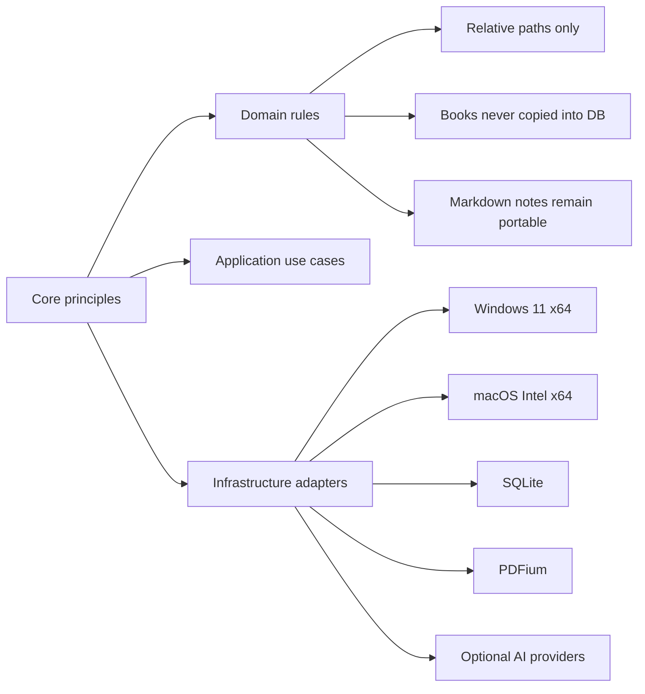

# Purpose

Document the architectural and product principles that constrain every design decision in Book Library.

# Background

Personal libraries tend to outlive applications. A reader may change tools and computers many times while keeping the same folder of PDFs, manga, papers, and notes. Book Library should respect that durability by avoiding lock-in, cloud dependence, hidden content storage, and platform-specific assumptions in core behavior.

# Requirements

- Desktop first: Windows 11 x64 and macOS Intel x64 are required platforms before web or mobile.
- One codebase: both operating systems share the same React, domain, and application implementation.
- Offline first: core reading, notes, search, and metadata must work without network access.
- Filesystem first: the library root is authoritative for book existence.
- Database second: SQLite stores metadata, indexes, and state only.
- Relative paths only: no persisted absolute paths for books, notes, thumbnails, or derived artifacts.
- Markdown notes: notes must remain readable in plain text and Obsidian.
- Optional AI: no core workflow may require AI or external services.
- Modular architecture: features and platform adapters must be replaceable and testable behind clear interfaces.
- Plugin friendly: extension points should be explicit, permissioned, and stable.
- AI-agent friendly docs: document decisions, invariants, and boundaries in implementation-ready language.

# Responsibilities

- Prevent architecture drift as implementation begins.
- Resolve trade-offs consistently when product pressure appears.
- Provide a checklist for code review and future design proposals.
- Make implicit product values explicit for human and AI contributors.

# Architecture

The app should be organized around stable domain rules rather than UI screens, operating systems, or infrastructure frameworks. Infrastructure components such as Tauri commands, SQLite repositories, PDFium adapters, filesystem watchers, and AI clients must point inward toward use cases and domain contracts.

No module should persist absolute filesystem paths. When an operating system path is required, it should be reconstructed at runtime from the configured root plus stored relative path. This keeps the library portable across Windows drive letters, macOS mount points, Google Drive Desktop locations, and backup restores.

Platform-specific case comparison, Unicode normalization, symlink handling, native binary loading, and packaging belong in infrastructure or desktop adapters. The domain preserves normalized relative path representation and must not silently lowercase user paths.

# Mermaid Diagram

# Data Model

Principle-level invariants to enforce in models and migrations:

- `relative_path` columns are mandatory for filesystem-backed entities.
- `absolute_path` columns are forbidden in persisted content identity.
- machine-local configured roots are settings, not portable book or note identifiers.
- `content_hash` may be stored as derived metadata, not as source content.
- `book_kind` must distinguish `pdf_file`, `image_folder`, and future kinds.
- `module_enabled` state must allow optional modules to be disabled cleanly.

# Future Extension

- Add architecture fitness tests that reject migrations containing absolute content-path columns.
- Add documentation linting to verify required headings and Mermaid blocks.
- Add plugin manifest validation for filesystem, database, network, and AI permissions.
- Add local-first conflict handling for metadata updated on multiple synchronized machines.
- Add Apple Silicon support without duplicating domain or application behavior.

# Open Questions

- Should architecture checks be enforced by CI once implementation starts?
- Should the app expose an advanced recovery tool to rebuild SQLite from files and notes?
- How much plugin API should be public before the first stable release?