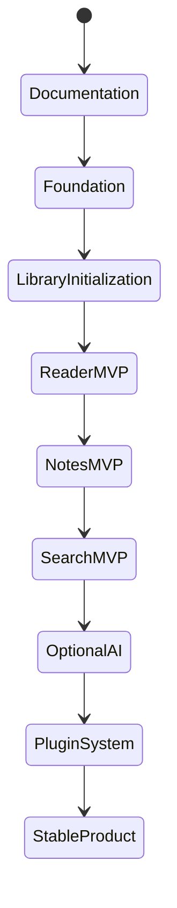

# Purpose

Define a phased delivery roadmap that turns the product vision into implementable milestones while preserving architectural integrity.

# Background

Book Library combines several product categories. Without a roadmap, the project could sprawl into a half-built Calibre clone, a basic PDF reader, or an AI demo. The roadmap prioritizes durable foundations first: library initialization, reader reliability, notes, and search before optional AI modules.

# Requirements

- Start with documentation and architecture before application code.
- Build a minimum usable local library system before advanced features.
- Keep each milestone independently useful and testable.
- Avoid requiring cloud credentials, AI keys, or Google Drive APIs.
- Defer plugin marketplace concerns until local module boundaries are stable.

# Responsibilities

- Sequence implementation work for contributors and AI coding agents.
- Identify dependencies between modules.
- Define release gates and quality expectations.
- Prevent advanced modules from contaminating the core design.

# Architecture

Milestones should align with architecture layers. Foundation milestones establish domain entities, filesystem scanning, SQLite persistence, and Tauri command boundaries. Reader milestones add PDFium and image-folder reading. Knowledge milestones add Markdown notes, backlinks, and FTS5 search. Enhancement milestones add OCR, dictionary, AI assistant, Anki, and plugins.

# Mermaid Diagram

# Data Model

Roadmap dependencies:

- `Library` and `Book` must exist before reader state.
- `ReadingLocation` must exist before bookmarks and history.
- `Note` must exist before backlinks and AI note augmentation.
- `SearchDocument` must exist before FTS5 queries.
- `Module` must exist before optional AI and plugin installation state.

# Future Extension

Suggested phases:

1. Documentation foundation: complete architecture, product, module, and ADR docs.
2. Core shell: Tauri 2 app, React layout, local settings, database migration runner.
3. Library initialization: root selection, scan, discovery, metadata, thumbnails.
4. Reader MVP: PDF reader, image-folder reader, bookmarks, history.
5. Knowledge MVP: Markdown notes, Obsidian compatibility, search.
6. Optional intelligence: OCR, dictionary, AI assistant, Anki export.
7. Plugin foundation: manifest, permissions, extension points, sandbox decisions.

# Open Questions

- Should version `0.1` include notes, or should it focus entirely on reading and scanning?
- Should OCR ship as a built-in optional module or as the first plugin proof of concept?
- Should plugin support be designed before or after the first working reader MVP?
