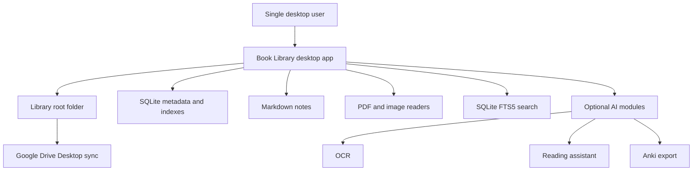

# Purpose

Define the product vision for Book Library: a desktop-first personal reading and knowledge management platform that treats the user-owned file library as the permanent source of truth.

# Background

Book Library exists for a single user who keeps books, papers, manga, notes, and knowledge artifacts in a local folder, commonly synchronized by Google Drive Desktop. The product combines selected strengths of Calibre, Kindle, Obsidian, and Zotero without becoming a cloud service or forcing content into an application-owned silo.

The application must begin as a carefully designed product before implementation. Its documentation should be complete enough for an engineer or AI coding agent to implement features without repeatedly asking architectural questions.

# Requirements

- Provide a desktop application built with Tauri 2, React, TypeScript, Tailwind, and Shadcn UI.
- Work offline without requiring account login, cloud APIs, or hosted services.
- Use one configurable library root folder as the canonical content location.
- Recognize PDF files and image folders as books.
- Store metadata, derived indexes, reading state, and search data in SQLite.
- Never copy book files into the database.
- Store notes as Markdown files using relative links compatible with Obsidian.
- Keep all persisted file references relative to the configured library root.
- Keep AI features optional, modular, and replaceable.
- Favor modular Clean Architecture boundaries over framework-driven coupling.

# Responsibilities

- Establish a product direction that protects user ownership of files.
- Define what Book Library is and is not.
- Guide implementation sequencing across library, reader, notes, search, AI, and plugin capabilities.
- Keep future contributors aligned around desktop-first and offline-first behavior.

# Architecture

Book Library should be structured as a local-first desktop product with a small trusted core and optional modules around it. The core application owns library discovery, metadata storage, reading state, Markdown note orchestration, and full-text indexing. Optional modules can add OCR, dictionary lookup, AI assistant features, Anki export, or future plugin capabilities.

The local filesystem remains the durable source of book truth. SQLite is a local operational database and index cache, not a replacement for the library. If the database is deleted, the app should rebuild core book records by scanning the library root again. User-authored Markdown notes should survive independently of the database.

# Mermaid Diagram

# Data Model

Core entities:

- `Library`: configured root folder and application-level settings.
- `Book`: discovered readable unit represented by a relative path.
- `BookAsset`: concrete file or folder backing a book.
- `Contributor`: author, editor, translator, or publisher metadata.
- `ReadingSession`: time-bounded reading activity.
- `Bookmark`: saved location in a book.
- `Note`: Markdown file associated with a book or topic.
- `SearchDocument`: normalized content indexed by SQLite FTS5.
- `Module`: optional feature package with declared permissions.

# Future Extension

- Multi-library support using separate roots and database namespaces.
- Plugin API for importers, exporters, metadata providers, readers, and note processors.
- Optional AI services for summarization, explanation, OCR correction, and semantic search.
- Zotero-style citation metadata for academic workflows.
- Obsidian vault mode where the library notes folder can be opened directly in Obsidian.

# Open Questions

- Should one application profile support multiple library roots in the first public release or later?
- Should notes live inside the library root by default or in a configurable sibling vault folder?
- Should image-folder books be allowed to contain nested chapter folders in the first release?
- Which PDFium distribution strategy is preferred for Windows packaging?
