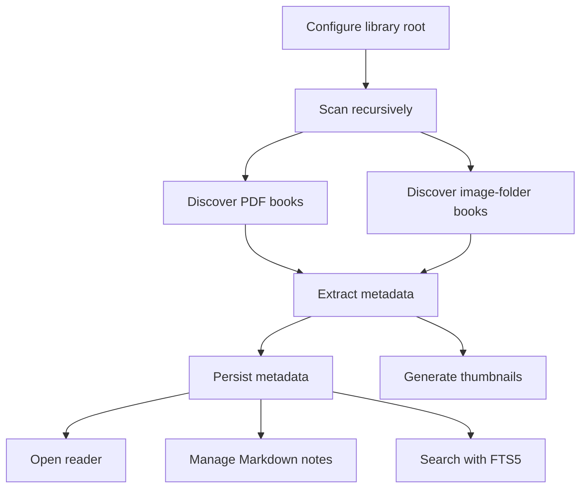

# Purpose

Capture product requirements for the first architecture-complete version of Book Library.

# Background

The user stores books in a normal folder hierarchy. Categories are represented by folders, not application-managed collections. PDF files are books. Folders containing ordered images are also books, especially for manga and scanned documents. Book Library should index and read these items while leaving files where they are.

# Requirements

Functional requirements:

- Configure one library root folder.
- Recursively scan the root for supported book candidates.
- Recognize `.pdf` files as PDF books.
- Recognize folders containing image files as image-folder books.
- Preserve relative paths as stable book identifiers.
- Generate and cache thumbnails without modifying source folders unless configured.
- Store metadata, reading history, bookmarks, and search indexes in SQLite.
- Create and edit Markdown notes associated with books and topics.
- Support Obsidian-compatible links and relative paths.
- Provide offline full-text search using SQLite FTS5.
- Provide optional OCR, dictionary, AI assistant, and Anki export modules.

Non-functional requirements:

- Work primarily on Windows desktop.
- Start quickly for existing indexed libraries.
- Recover from deleted or corrupt SQLite database by rescanning.
- Handle large libraries incrementally.
- Avoid destructive filesystem actions.
- Keep UI responsive during scanning and indexing.

# Responsibilities

- Define the product scope for implementation.
- Separate mandatory core behavior from optional modules.
- Provide acceptance criteria for future development tasks.
- Clarify what should not be built into the first implementation.

# Architecture

Requirements map to application use cases: initialize library, discover books, read book, track progress, manage notes, search library, run optional module. Each use case should be callable from Tauri commands and testable independently from React UI.

# Mermaid Diagram

# Data Model

Minimum required tables:

- `libraries`: configured roots and settings.
- `books`: discovered books with kind, relative path, title, status, timestamps.
- `book_files`: files belonging to a book, especially image pages.
- `book_metadata`: optional bibliographic metadata.
- `thumbnails`: cached thumbnail paths and generation state.
- `reading_history`: sessions and current progress.
- `bookmarks`: named reading locations.
- `notes`: Markdown file references and note associations.
- `search_index_queue`: pending indexing work.

# Future Extension

- EPUB and CBZ/CBR support.
- Metadata import from ISBN, DOI, BibTeX, or Zotero export.
- Reading statistics dashboards.
- Tagging, smart collections, and saved searches.
- Cross-device metadata conflict resolution when Google Drive Desktop syncs app data.

# Open Questions

- Should the first release support editing PDF metadata or only app-local metadata?
- Should image folder page ordering use natural sort only or allow custom ordering files?
- Should generated thumbnails live under app data or inside a hidden library folder?
