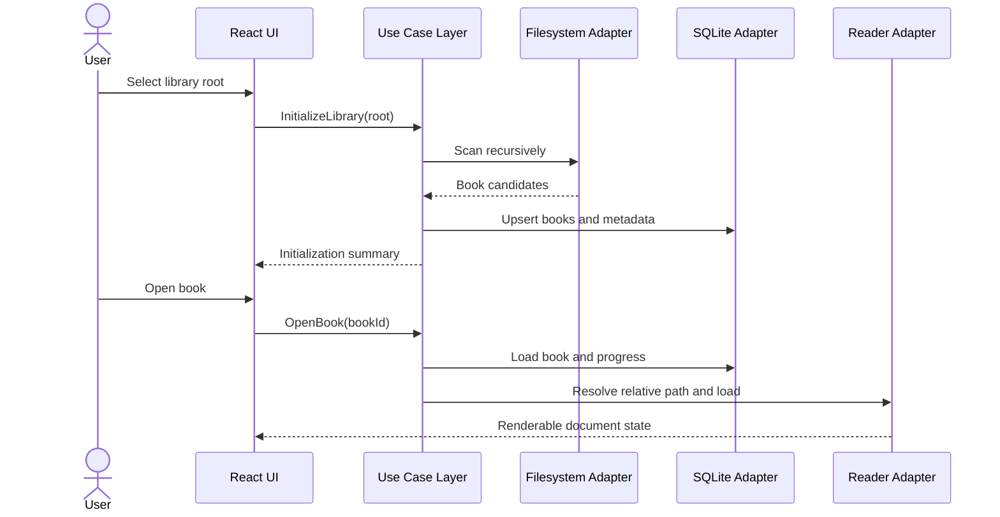

# Purpose

Describe the primary user and system use cases that Book Library must support.

# Background

A single user wants to browse, read, annotate, search, and connect knowledge across a locally stored collection. The app should be useful even if the folder is managed outside the app through File Explorer, Google Drive Desktop, or another tool.

# Requirements

- Use cases must be independent from UI implementation details.
- Each use case must define actor intent, inputs, outputs, and side effects.
- Use cases must not assume cloud availability.
- Filesystem changes outside the app must be discoverable and reconcilable.

# Responsibilities

Core use cases:

- Initialize library from a selected root folder.
- Rescan library on demand.
- Watch library changes after initialization.
- Open a PDF book.
- Open an image-folder book.
- Resume reading from last location.
- Add bookmark at current location.
- Create or open Markdown note for a book.
- Search books, notes, and indexed text.
- Run optional OCR for eligible content.
- Export selected notes or cards to Anki-compatible format.

# Architecture

Use cases should live in the application layer. They depend on domain interfaces such as `BookRepository`, `LibraryScanner`, `ReaderStateRepository`, `NoteRepository`, `SearchIndexer`, and `ModuleRegistry`. Infrastructure adapters implement those interfaces using SQLite, Windows filesystem APIs, PDFium, Markdown files, and optional service clients.

# Mermaid Diagram

# Data Model

Use case input and output contracts:

- `InitializeLibraryInput`: root path selected by user.
- `InitializeLibraryResult`: counts for added, updated, skipped, failed.
- `OpenBookInput`: book ID or relative path.
- `OpenBookResult`: book metadata, reader kind, restored location.
- `CreateBookNoteInput`: book ID, note template, target path policy.
- `SearchInput`: query string, scopes, filters, pagination.
- `SearchResult`: ranked books, notes, pages, snippets.

# Future Extension

- Bulk metadata editing.
- Reading plans and goal tracking.
- Topic notes independent from books.
- BibTeX and CSL citation workflows.
- Plugin-provided use cases registered through a module manifest.

# Open Questions

- Should user-facing collections be derived from folders only at first?
- Should notes be created automatically when opening a book or only on demand?
- Should search results include page-level hits before OCR is implemented?
