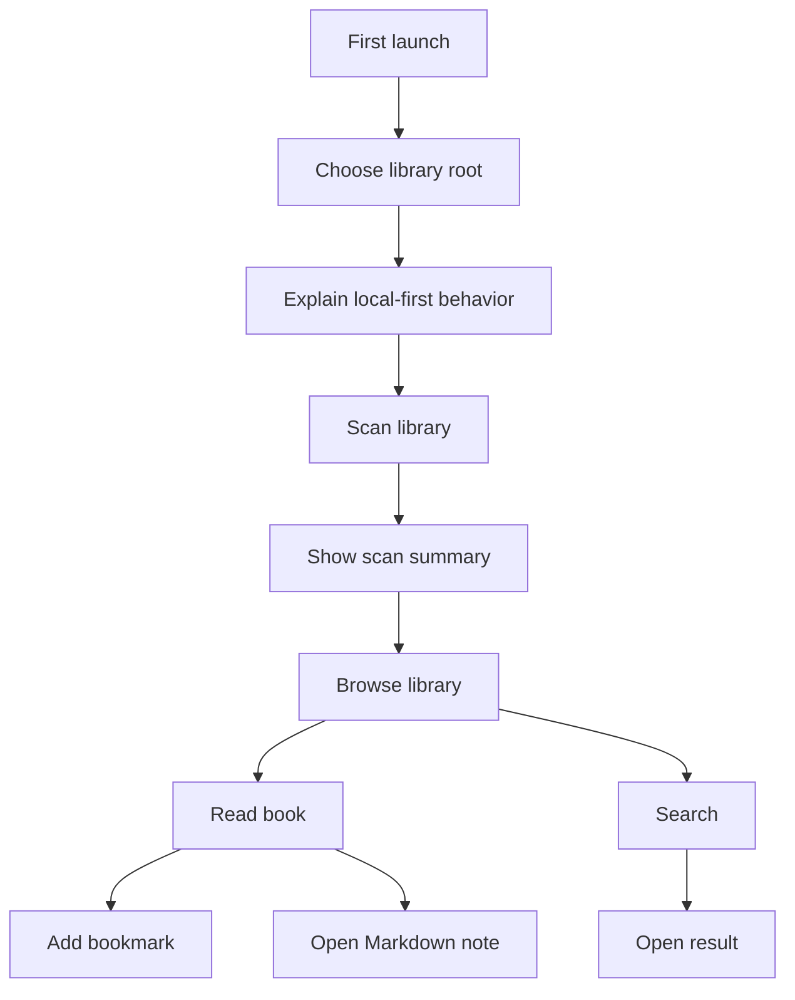
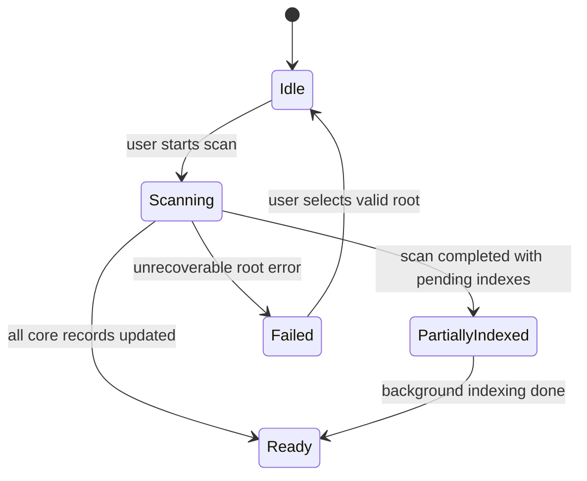

# Purpose

Define user-facing flows for library setup, reading, notes, search, and optional enhancements.

# Background

The product should feel simple to a single desktop user while hiding substantial local-first architecture. Flows should minimize setup friction and avoid surprises such as moving files, uploading content, or creating cloud dependencies.

# Requirements

- First-run flow must explain that the selected folder remains the source of truth.
- Scanning flow must show progress and non-fatal errors.
- Reading flow must restore the last known location.
- Notes flow must create normal Markdown files.
- Search flow must distinguish metadata, notes, and indexed content matches.
- Optional AI flows must clearly show module enablement and data usage.

# Responsibilities

- Provide implementation-ready UX flow definitions.
- Clarify state transitions for long-running operations.
- Identify error and recovery states.
- Keep user trust high by making local-file behavior explicit.

# Architecture

UI flows should call application use cases through Tauri commands. Long-running operations such as scanning, thumbnail generation, OCR, and indexing should report progress through events. The frontend should render optimistic but reversible UI states and never mutate domain state directly.

# Mermaid Diagram

# Data Model

Flow state should be represented explicitly:

- `library_state`: `unconfigured`, `scanning`, `ready`, `degraded`, `error`.
- `scan_job`: job ID, status, progress counts, started/finished timestamps.
- `scan_issue`: relative path, severity, message, retryability.
- `reader_state`: book ID, location, zoom, layout mode, updated timestamp.
- `module_state`: module ID, enabled flag, configuration status.

# Future Extension

- Guided onboarding sample library.
- Recovery wizard for moved library roots.
- Conflict review screen for Google Drive Desktop metadata sync conflicts.
- Plugin onboarding prompts that explain permissions before enabling a module.

# Open Questions

- Should first-run scan begin automatically after root selection or require explicit confirmation?
- How should the UI present folders that are categories versus image-folder books?
- Should scan issues be persisted forever or cleared after successful rescan?
