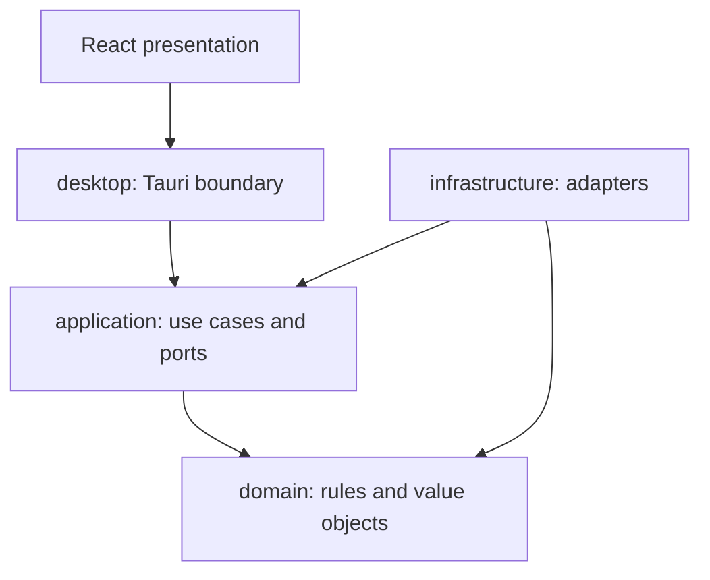
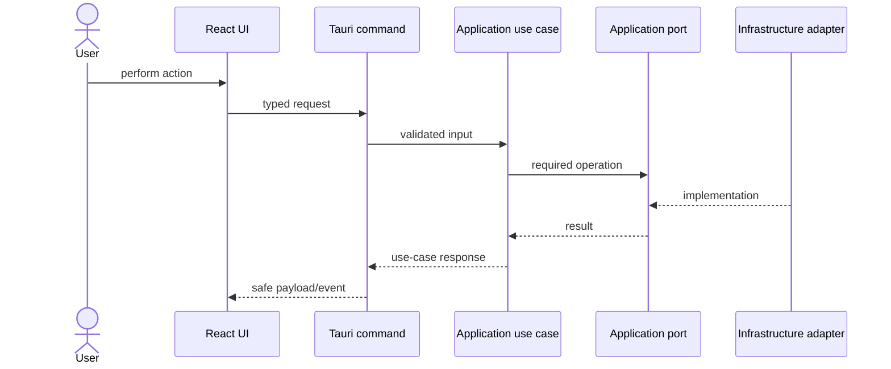
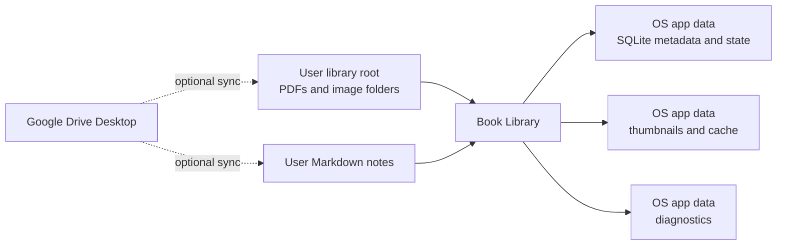

# System Architecture

## Status

**Accepted baseline for Sprint 01.** This document defines the implementation boundaries. Detailed behavior belongs in the module specifications, while binding alternatives are recorded in [ADRs](../adr/README.md).

## Goals

Book Library must remain understandable and safe for a solo developer while combining filesystem discovery, reading, notes, search, and optional intelligence.

The architecture optimizes for:

- Windows 11 x64 and macOS Intel x64 desktop operation from one codebase;
- offline daily use;
- user ownership of source books and Markdown notes;
- recoverable background work;
- testable domain and application behavior independent of the host operating system;
- replaceable SQLite, filesystem, PDFium, OCR, and AI adapters;
- incremental delivery without premature services or plugin infrastructure.

## Architecture style

The first implementation is a **Rust modular monolith** inside a Tauri 2 application. React and TypeScript form the presentation layer. Rust owns authoritative domain rules, use cases, filesystem access, SQLite access, jobs, and reader adapters.

The initial Rust structure is:

```text
src-tauri/src/
  domain/          # entities, value objects, policies, domain errors
  application/     # use cases, ports, transactions, jobs, DTO-independent rules
  infrastructure/  # SQLite, filesystem, PDFium, Markdown, FTS5, optional providers
  desktop/         # Tauri commands/events and dependency composition
```

Feature-oriented submodules such as `library`, `reader`, `notes`, `search`, and `settings` live inside the owning layer. Do not create a second implementation of a feature in another layer.

See [ADR-006](../adr/ADR-006-rust-modular-monolith.md).

## Supported platforms and portability boundaries

Windows 11 x64 and macOS Intel x64 are required platforms from M0. They share one React frontend and one Rust domain/application implementation. See [ADR-007](../adr/ADR-007-supported-desktop-platforms.md).

Platform-specific behavior is allowed only where the operating system or native dependency actually requires it:

- filesystem availability, symlink resolution, watcher behavior, case handling, and Unicode behavior;
- OS application-data and secure-storage locations;
- native file dialogs and reveal/open operations;
- PDFium native binary loading and packaging;
- Google Drive Desktop placeholder and hydration behavior;
- installer, signing, notarization, and release packaging.

These differences belong in `infrastructure` or `desktop` adapters behind shared application ports. Domain and application modules must not branch on operating-system names to decide business behavior.

Persisted relative paths preserve normalized spelling and Unicode and use `/` separators. The domain must not force lowercase identity. Filesystem-specific comparison and collision detection are adapter policies because case sensitivity may vary by platform and volume.

Apple Silicon and universal macOS binaries are deferred. Supporting them later must not require a second domain model, application layer, or product repository.

## Dependency direction

Compile-time dependencies point inward:



Rules:

- `domain` never imports Tauri, SQLite, filesystem, PDFium, React, or provider SDKs;
- `application` coordinates domain behavior and defines the ports it needs;
- `infrastructure` implements those ports;
- `desktop` is the composition root and translates Tauri payloads to use-case requests;
- React never reads SQLite or source folders directly;
- Tauri commands contain authorization/validation at the boundary, translation, and delegation—not business rules.

Runtime call flow travels from UI toward adapters, but that does not reverse source-code dependency direction:



## Module ownership

| Module | Owns | Does not own |
|---|---|---|
| Library | root configuration, scan/discovery policy, catalog reconciliation, thumbnails | reader rendering, note text, UI state |
| Reader | reader sessions, page navigation, reading locations, progress, bookmarks | catalog mutation, source-file modification |
| Notes | Markdown creation/parsing, note projections, links, external-editor integration | proprietary note storage, book scanning |
| Search | rebuildable search documents, indexing jobs, FTS queries | canonical book or note content |
| Settings | machine-local configuration and user preferences | domain identities or feature behavior |
| Optional modules | OCR, dictionary, AI, Anki providers behind ports | mandatory core workflows |

Modules communicate through application use cases, ports, and explicit events. A module must not import another module's private adapter or repository implementation.

## Data ownership

Book Library separates canonical user data from application-owned state.



### Canonical data

- PDF files and image folders are owned by the user filesystem.
- Markdown files are canonical for note text.
- The application does not rename, move, delete, or rewrite source books unless a future explicit user operation is designed for that purpose.

### Application-owned data

SQLite stores metadata, settings, reading state, job state, relationships, and indexes. Thumbnails, extracted text, and search projections are rebuildable derived artifacts.

The database, caches, and logs live in OS application data, outside the library root. See [ADR-005](../adr/ADR-005-local-application-data.md).

### Path model

- the configured library root is an absolute, machine-local setting;
- persisted book and page references are normalized paths relative to that root;
- the configured notes root is an absolute, machine-local setting;
- persisted note references are normalized paths relative to the notes root;
- absolute roots are resolved only at infrastructure boundaries;
- relative paths reject drive letters, UNC roots, Windows/POSIX leading root separators, and `..` escapes;
- normalized relative paths preserve spelling and Unicode and are not unconditionally lowercased;
- filesystem adapters enforce root containment after symlink or equivalent path resolution.

## Core execution patterns

### Use cases

Each user action enters through one application use case, such as `InitializeLibrary`, `OpenBook`, `SaveReadingProgress`, `CreateBookNote`, or `SearchLibrary`. Use cases own orchestration and transaction boundaries.

### Background jobs

Scanning, thumbnail generation, indexing, OCR, and other long-running work execute as jobs. Jobs must:

- report typed progress;
- support cancellation where technically safe;
- persist enough state for restart recovery when the milestone requires it;
- isolate failure to the smallest useful unit, such as one candidate or one page;
- never leave canonical user files partially rewritten.

### Events

Events communicate progress and completed state changes to the UI or other modules. Event names describe facts in past tense, for example `scan-progressed`, `scan-completed`, or `reading-progress-saved`. Events do not replace use-case calls or transactional consistency.

### Errors

Domain and application errors are typed. The desktop boundary maps them to stable, user-safe error codes and messages. Logs may contain technical context but must not include note bodies, extracted book text, API secrets, or unnecessary absolute paths.

## Persistence groups

The schema evolves by milestone. The architecture anticipates these groups without requiring every table in the first migration:

- configuration: application settings and configured libraries;
- catalog: books, book files, metadata, and scan issues;
- operations: scan, thumbnail, indexing, and later OCR jobs;
- reading: current state, history, and bookmarks;
- notes: file projections and relationships;
- search: rebuildable search documents and FTS5 tables.

Repositories expose domain/application concepts rather than generic CRUD methods. Migrations are forward-only and accompanied by recovery guidance when user state is affected.

## Initial technology boundaries

- Tauri 2 provides the desktop shell, native dialogs, paths, commands, and events on both supported platforms.
- React and TypeScript provide screens, components, routing, and view state.
- Rust implements shared domain, application, and infrastructure contracts.
- SQLite stores local operational data and FTS5 indexes through OS-specific application-data locations.
- PDFium is isolated behind the PDF reader port; the binding and native packaging choice requires a Sprint 01 spike covering Windows x64 and macOS Intel x64.
- Markdown parsing and writing are isolated behind notes ports.
- Google Drive APIs are not integrated; Google Drive Desktop is external to the app and must be observed separately on both platforms.

## Architecture fitness checks

Sprint 01 should establish checks that make the most important rules difficult to violate:

- unit tests for `RelativePath` invariants across Windows-style and POSIX-style inputs;
- integration tests using temporary roots and SQLite databases;
- a frontend rule forbidding direct filesystem/database packages;
- Rust visibility that keeps adapter implementations private;
- CI for formatting, linting, tests, builds, and Markdown links on supported environments;
- real Windows 11 x64 and macOS Intel x64 smoke evidence for desktop/native changes;
- review checks for new persisted absolute-path fields, unconditional path lowercasing, and destructive file operations.

## Deferred architecture

The following are intentionally deferred until a working core proves the need:

- multiple Rust workspace crates;
- an external plugin host or sandbox;
- cloud accounts and metadata synchronization;
- semantic/vector databases;
- multi-user or server architecture;
- Apple Silicon and universal macOS release targets;
- additional reader formats beyond PDF and image folders.

A deferred item must not shape core APIs unless required by a current acceptance criterion.