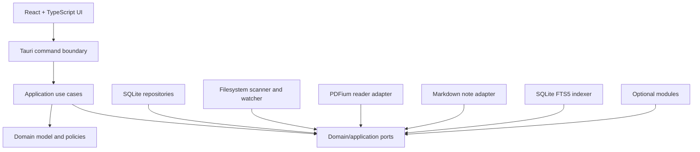
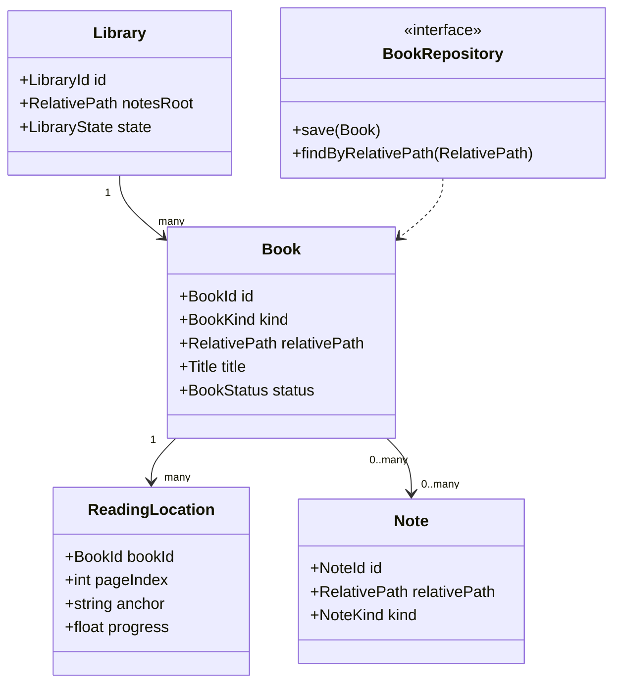

# Purpose

Define the system architecture for Book Library using a modular Clean Architecture mindset suitable for a Tauri 2 desktop application.

# Background

Book Library must combine reading, library management, notes, search, and optional intelligence while staying maintainable for a solo developer and approachable for AI coding agents. The architecture must protect the domain model from UI, database, filesystem, PDFium, and AI-provider details.

# Requirements

- Use Tauri 2 as the desktop shell and native bridge.
- Use React, TypeScript, Tailwind, and Shadcn UI for the frontend.
- Use SQLite for local metadata, indexes, jobs, and reading state.
- Use PDFium through a reader adapter rather than coupling it to the UI.
- Keep domain rules independent from Tauri commands and React components.
- Treat the filesystem as a first-class infrastructure adapter.
- Support optional modules without making the core depend on them.
- Keep relative paths as domain values.

# Responsibilities

- Define application layers and dependency direction.
- Identify stable module boundaries.
- Provide implementation guidance for commands, events, jobs, and persistence.
- Establish where validation and invariants belong.

# Architecture

Recommended layers:

- Presentation: React screens, components, view models, client-side routing, Shadcn UI composition.
- Desktop boundary: Tauri commands, Tauri events, native window integration, file picker integration.
- Application: use cases, job orchestration, module registry, transactional workflows.
- Domain: entities, value objects, policies, domain errors, interfaces.
- Infrastructure: SQLite repositories, filesystem scanner, watcher, PDFium adapter, image loader, Markdown adapter, FTS5 indexer, thumbnail generator.

Dependency direction must point inward. Infrastructure implements interfaces defined by the application or domain layer. React must not access SQLite directly. Tauri commands should be thin translators from frontend requests into application use cases.

# Mermaid Diagram

# Data Model

Core database groups:

- Configuration: `libraries`, `settings`, `module_settings`.
- Catalog: `books`, `book_files`, `book_metadata`, `contributors`, `book_contributors`.
- Operations: `scan_jobs`, `scan_issues`, `thumbnail_jobs`, `index_jobs`.
- Reading: `reading_state`, `reading_history`, `bookmarks`, `highlights`.
- Notes: `notes`, `note_links`, `book_note_links`.
- Search: FTS5 virtual tables for books, notes, OCR text, and metadata snippets.

All filesystem references must use relative paths. Runtime services may resolve absolute paths by combining `library_root_absolute_path` from user settings with relative paths, but absolute paths should not be propagated into domain entities unless wrapped in a non-persistable runtime type.

# Future Extension

- Background job scheduler with cancellation and persistence.
- Plugin host process or sandbox model.
- Sync-safe metadata export files for users who want database-independent recovery.
- Integration tests using fixture libraries.

# Open Questions

- Should Rust own all application use cases, or should some app logic live in TypeScript?
- Should the SQLite database be stored in app data or inside the library root?
- Should optional modules run in-process initially or behind a separate boundary?
