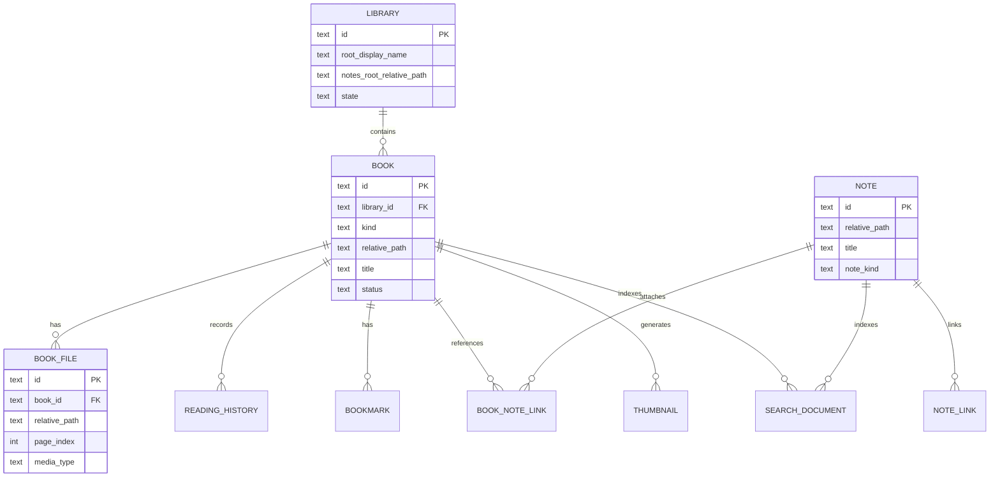

# Purpose

Define the domain model for books, libraries, notes, reading state, metadata, and optional modules.

# Background

The domain model must represent user-owned files without assuming that the application controls the folder. A book may be a single PDF file or a folder of images. Notes are Markdown files. Derived artifacts such as thumbnails, OCR text, and indexes are rebuildable.

# Requirements

- Model `Book` as a discovered readable unit, not necessarily a single file.
- Use `RelativePath` as a domain value object for persisted file references.
- Represent image-folder pages deterministically using natural sorting.
- Separate source files from derived artifacts.
- Allow metadata to be incomplete, user-edited, or externally derived.
- Represent reading locations in a reader-agnostic way where possible.
- Keep optional AI outputs separate from canonical user notes unless accepted by the user.

# Responsibilities

- Provide entity boundaries for implementation.
- Define aggregates and invariants.
- Keep filesystem, database, and UI details out of domain entities.
- Support future readers and metadata providers.

# Architecture

Primary aggregates:

- `Library`: root configuration and policy settings.
- `Book`: readable item with kind-specific backing asset.
- `Note`: Markdown artifact that can link to books, pages, topics, and other notes.
- `ReadingState`: current position and historical sessions.
- `SearchDocument`: indexable projection of books, notes, and OCR text.
- `Module`: optional capability with enablement and permissions.

# Mermaid Diagram

# Data Model

Important value objects:

- `RelativePath`: normalized path using `/` separators, no drive letter, no leading root marker, no `..` escape.
- `BookKind`: `pdf_file`, `image_folder`, future `epub_file`, future `archive_file`.
- `BookStatus`: `available`, `missing`, `unsupported`, `error`, `ignored`.
- `ReadingLocation`: page index, optional text anchor, progress ratio, reader-specific payload.
- `ContentFingerprint`: file size, modified time, optional hash for change detection.
- `NoteLinkTarget`: book ID, note path, heading anchor, page location, external URL.

# Future Extension

- Citation entities: `CitationKey`, `Publication`, `Identifier`, `BibliographyEntry`.
- Semantic entities: `Concept`, `Topic`, `Claim`, `Excerpt`.
- Multi-user annotations are out of scope but the model should not prevent future export/import.
- Plugin-defined metadata namespaces.

# Open Questions

- Should book IDs be deterministic from relative path or generated UUIDs with path uniqueness?
- Should a renamed file preserve reading state through fingerprint matching?
- How should manga volumes represented by nested folders map to `Book` and `BookFile`?
