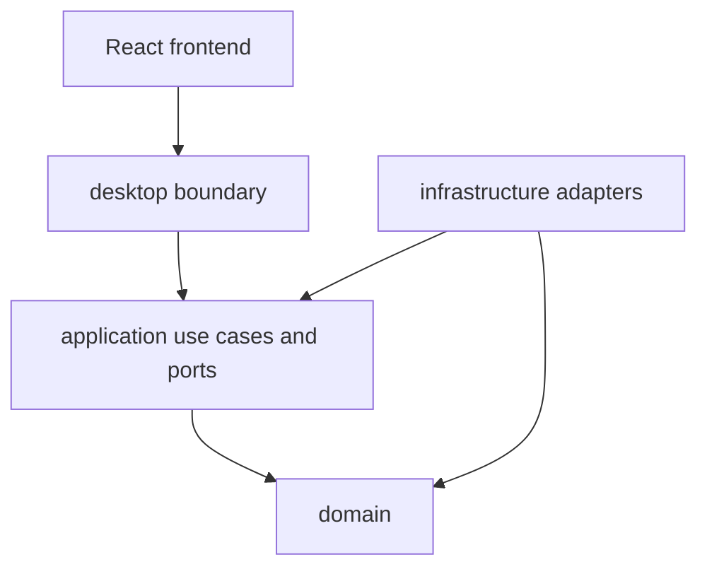

# Module Dependency Rules

## Status

Accepted for the initial Rust modular monolith. See [system architecture](architecture.md) and [ADR-006](../adr/ADR-006-rust-modular-monolith.md).

## Purpose

Prevent UI, database, filesystem, reader, notes, search, and optional-provider code from bypassing application use cases or creating circular ownership.

## Initial module shape

The initial implementation uses modules inside one Tauri Rust crate rather than separate workspace crates:

```text
src-tauri/src/
  domain/
  application/
  infrastructure/
    sqlite/
    filesystem/
    reader_pdf/
    reader_image/
    markdown/
    search/
    optional/
  desktop/
```

Feature submodules may exist inside the owning layer. Names may evolve during scaffolding, but dependency direction and ownership do not.

## Allowed dependencies

| From | May depend on | Must not depend on |
|---|---|---|
| `domain` | standard library and narrowly justified domain-safe libraries | application, infrastructure, desktop, Tauri, SQLite, React, PDFium, provider SDKs |
| `application` | domain | concrete adapters, Tauri commands, React, raw SQL, provider SDKs |
| `infrastructure` | application ports and domain types | presentation/UI modules, another adapter's private implementation |
| `desktop` | application, infrastructure composition, Tauri | business rules, raw SQL, scanner/reader policy implemented directly in commands |
| React frontend | typed command/event contracts and presentation libraries | SQLite, Rust repositories, direct source-folder access, authoritative domain rules |



The diagram shows source-code dependency direction. Runtime calls can travel through a port to an adapter without making the application depend on the adapter implementation.

## Feature ownership

### Library

Owns root configuration use cases, scanning/discovery policies, catalog reconciliation, and thumbnail orchestration. Reader and notes modules consume catalog read models or ports; they do not mutate catalog tables directly.

### Reader

Owns reader sessions, page rendering/navigation contracts, reading locations, progress, and bookmarks. PDFium and image loading are adapters. Reader code does not rename or rewrite books.

### Notes

Owns Markdown workflows, parsing, note projections, links, and external-editor integration. Search consumes note projections/events rather than reading notes through a private adapter.

### Search

Owns search-document projections, indexing jobs, queries, and repair. It does not become the canonical owner of books, notes, or OCR output.

### Optional capabilities

OCR, dictionary, AI, Anki, and later module experiments implement explicit application ports. They are disabled by default and cannot be imported by core domain/use cases as mandatory dependencies.

The first proof of concept uses trusted in-process modules. An external/untrusted plugin host is deferred until there is a concrete sandbox requirement.

## Communication rules

Prefer, in order:

1. direct domain/application function calls inside the owning use case;
2. application ports for infrastructure operations;
3. committed events for progress or cross-module follow-up work;
4. read models for presentation queries.

Avoid:

- importing another module's concrete repository;
- writing another module's tables directly;
- using events to hide required synchronous validation or transaction work;
- exposing generic database CRUD through Tauri;
- creating a shared `utils` or `common` module with unrelated responsibilities;
- adding a plugin abstraction before a current feature needs one.

## Visibility and composition

- default to private or `pub(crate)` visibility;
- expose the smallest contract needed by the next layer;
- construct concrete adapters in the desktop composition root;
- keep configuration/provider selection outside domain entities;
- keep Tauri serialization DTOs separate when domain types should not carry transport concerns.

## Enforcement

Sprint 01 should establish:

- directory/module layout matching these boundaries;
- domain tests that compile without infrastructure fixtures;
- review/lint checks preventing frontend database/filesystem packages;
- narrow Rust visibility;
- integration tests that compose real adapters through application ports.

Extract a module into a separate crate only after it has a stable contract, independent test boundary, measurable build/isolation benefit, or packaging requirement.

## Future evolution

Potential later steps include workspace crates, versioned trusted-module manifests, and an external sandboxed plugin host. Each change requires an ADR and must preserve core independence from optional modules.