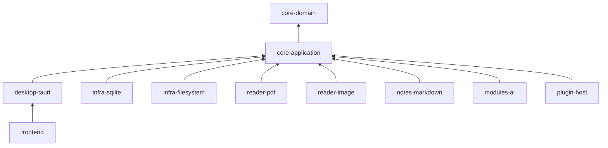

# Purpose

Define module boundaries and allowed dependencies for the Book Library codebase.

# Background

The project must remain understandable and modular as features grow. Without dependency rules, reader code can leak into scanning, AI clients can leak into notes, and UI components can bypass use cases. This document prevents that erosion.

# Requirements

- Core domain must depend on no infrastructure module.
- Application use cases may depend on ports, not concrete adapters.
- Reader modules must not mutate catalog records directly.
- AI modules must be optional and must not be required by notes or search.
- Plugin APIs must depend on stable contracts rather than internal repositories.
- Shared utilities must not become a hidden dependency dumping ground.

# Responsibilities

- Define allowed dependency direction.
- Clarify module ownership.
- Give future implementers a map for project folder structure.
- Make architectural violations easy to spot in code review.

# Architecture

Suggested implementation modules:

- `core-domain`: entities, value objects, domain services, errors.
- `core-application`: use cases, ports, job orchestration, transactions.
- `infra-sqlite`: migrations, repositories, FTS5, transactional unit of work.
- `infra-filesystem`: scanner, path normalization, watcher, thumbnail IO.
- `reader-pdf`: PDFium loading and rendering adapter.
- `reader-image`: image-folder page ordering and rendering adapter.
- `notes-markdown`: Markdown file creation, parsing, backlinks.
- `modules-ai`: OCR, dictionary, assistant, Anki integrations.
- `desktop-tauri`: command and event bridge.
- `frontend`: React UI.

# Mermaid Diagram

# Data Model

Dependency metadata should eventually be represented in module manifests:

- `module_id`: stable identifier.
- `module_type`: reader, indexer, exporter, AI provider, metadata provider.
- `requires`: declared ports or feature capabilities.
- `permissions`: filesystem, network, database projection, model access.
- `enabled`: user-controlled state.
- `version`: semantic version for compatibility checks.

# Future Extension

- Add static dependency checks once code structure exists.
- Convert optional features into first-class plugin modules.
- Add interface versioning for plugin contracts.
- Support external command modules with restricted permissions.

# Open Questions

- Should modules be Rust crates, TypeScript packages, or conceptual folders in early phases?
- Should the plugin API initially support only local trusted plugins?
- Should AI modules use the same manifest system as non-AI plugins?
