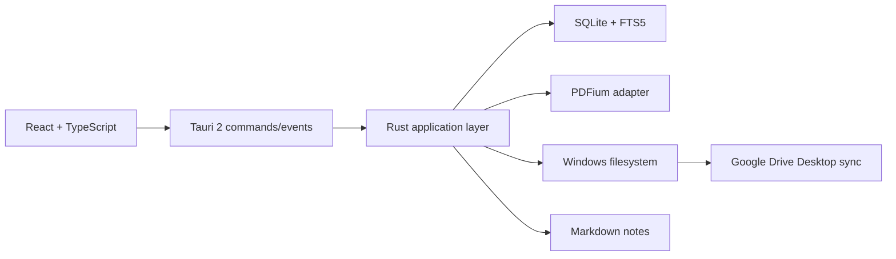

# Purpose

Define the selected technology stack and how each technology should be used.

# Background

The stack should fit a desktop-first, offline-first, local-file application. Tauri 2 provides a small native shell. React and TypeScript support productive UI development. SQLite is reliable for local metadata and FTS5. PDFium is a proven PDF rendering engine. Google Drive Desktop handles synchronization outside the app.

# Requirements

- Use Tauri 2 for desktop packaging, native commands, file dialogs, and filesystem integration.
- Use React and TypeScript for frontend application logic.
- Use Tailwind and Shadcn UI for consistent UI composition.
- Use SQLite for metadata, jobs, reading state, and FTS5 indexes.
- Use PDFium for PDF rendering.
- Use Markdown files for notes.
- Use Windows local filesystem semantics as the first supported environment.
- Do not integrate Google Drive APIs for synchronization.

# Responsibilities

- Explain why each technology exists in the architecture.
- Define boundaries where stack-specific code is allowed.
- Clarify operational risks for packaging and local data management.
- Guide future dependency decisions.

# Architecture

Tauri commands should expose coarse use-case operations, not raw repository methods. React should consume typed command responses and event streams. SQLite should be accessed only through repositories and migrations. PDFium should be isolated behind a reader adapter so it can be replaced or upgraded. Tailwind and Shadcn UI should be presentation-only and never encode domain rules.

# Mermaid Diagram

# Data Model

Technology ownership:

- SQLite owns relational metadata, indexes, and job state.
- Markdown owns user-authored notes and Obsidian-compatible knowledge text.
- Filesystem owns book existence and byte content.
- PDFium owns rendering and PDF page extraction at runtime.
- React owns view state and user interaction.
- Tauri owns privileged native operations and frontend/backend communication.

# Future Extension

- Add cross-platform support for macOS and Linux after Windows stabilizes.
- Add local embedding database only if semantic search becomes a priority.
- Add WebView-independent reader rendering experiments if PDFium integration becomes limiting.
- Add import/export adapters for Zotero, Calibre, and Anki.

# Open Questions

- Which Rust PDFium binding best supports Tauri 2 packaging on Windows?
- Should migrations be managed by a Rust migration crate or custom SQL runner?
- Should frontend state use a dedicated library or remain simple until complexity requires it?
