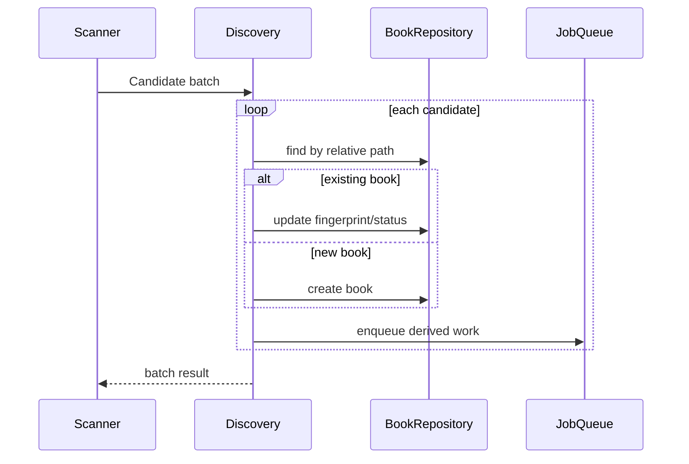

# Purpose

Define discovery policies that convert scanner candidates into domain `Book` records.

# Background

Scanning finds filesystem candidates. Discovery decides what those candidates mean to the application. This includes title derivation, book kind, status, identity, metadata extraction, duplicate handling, and updates when paths change.

# Requirements

- Convert PDF candidates into `Book` records with kind `pdf_file`.
- Convert image-folder candidates into `Book` records with kind `image_folder`.
- Derive an initial title from filename or folder name.
- Use relative path uniqueness within a library.
- Update existing records when fingerprints change.
- Mark missing records when files disappear instead of deleting history immediately.
- Preserve user-edited metadata when rediscovering a book.
- Allow a user to replace the app-local display title without renaming the
  source; later scans preserve titles whose source is `user`.
- Generate follow-up jobs for thumbnails, FTS indexing, and optional OCR.
- Present the catalog in relative-path order so folder organization remains
  visible; use title only as a secondary tie-breaker.

# Responsibilities

- Apply domain rules to filesystem candidates.
- Maintain stable catalog records.
- Separate source discovery from derived processing.
- Keep user metadata safe during rescans.

# Architecture

Discovery belongs in the application layer because it coordinates scanner results, domain policies, repositories, and jobs. It should run inside controlled transactions per batch to balance performance and recoverability.

# Mermaid Diagram

# Data Model

Discovery fields:

- `books.relative_path`: unique within `library_id`.
- `books.title`: derived title unless user has overridden it.
- `books.title_source`: `derived`, `user`, `metadata`, `plugin`.
- `books.status`: availability and error state.
- `books.fingerprint`: serialized fingerprint for change detection.
- `book_files.page_index`: natural sort order for image folders.
- `book_metadata.source`: provenance of metadata values.

# Future Extension

- Fuzzy relocation matching when files move.
- Metadata enrichment from filename patterns, sidecar files, DOI, ISBN, or plugins.
- Duplicate detection by content hash.
- User rules for ignoring folders or treating nested folders as volumes.

# Settled M1 policy

- Missing records remain in catalog history and are never deleted automatically.
- PDF candidates and eligible direct-image folders are independent books, even
  in a mixed folder.
- Folder hierarchy is context only; collection records are deferred.
- An eligible folder named `pages` derives its display title from its immediate
  parent while preserving the parent's Unicode spelling and punctuation.

See ADR-008 for path identity and image-folder details.
