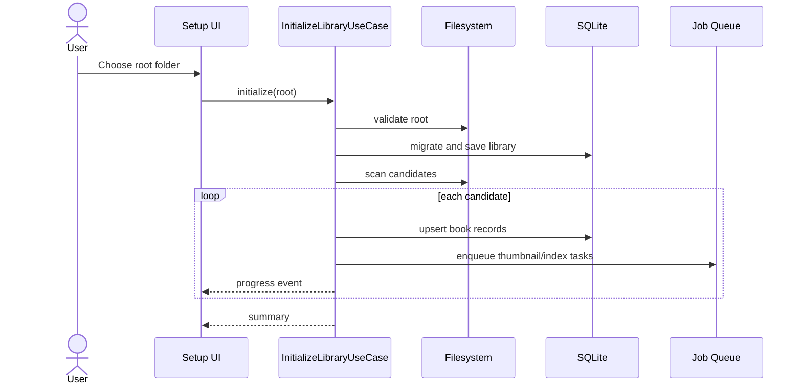

# Purpose

Define how Book Library initializes a user library from a selected root folder.

# Background

The first durable user action is selecting a library root. The app must explain that files remain in place, then scan and build local metadata. Initialization should be resumable, observable, and safe for large folders synchronized by Google Drive Desktop.

# Requirements

- Accept one user-selected root folder.
- Validate that the root exists and is readable.
- Store the root location in local application settings.
- Store all book and note references relative to the root.
- Create or migrate the SQLite database.
- Start a recursive scan and report progress.
- Record scan issues without aborting the entire initialization unless the root itself is unusable.
- Generate initial metadata, thumbnails, and indexing jobs.

# Responsibilities

- Convert an unconfigured app into a ready library workspace.
- Create baseline records needed by all later modules.
- Establish the filesystem root used for relative path resolution.
- Avoid modifying source book files.

# Architecture

Initialization is an application use case coordinated by a job. It validates the root, creates database structures, records library configuration, scans candidates, upserts books, schedules thumbnail and indexing work, and emits progress events. It should support cancellation and safe retry.

# Mermaid Diagram

# Data Model

Initialization tables:

- `libraries(id, root_display_name, notes_root_relative_path, state, created_at, updated_at)`
- `app_settings(key, value, updated_at)` for runtime root location and UI preferences.
- `scan_jobs(id, library_id, status, started_at, finished_at, added_count, updated_count, error_count)`
- `scan_issues(id, scan_job_id, relative_path, severity, code, message)`
- `books(id, library_id, kind, relative_path, title, status, fingerprint, created_at, updated_at)`

# Future Extension

- Support multiple library roots.
- Offer dry-run scan preview before committing records.
- Detect moved roots and help the user relink them.
- Export initialization reports for debugging.

# Settled M1 policy

- SQLite, caches, logs, and thumbnails live outside the library root in OS app
  data under ADR-005.
- Notes-folder creation is deferred to the notes workflow.
- Hidden and system entries are skipped conservatively under ADR-008.
