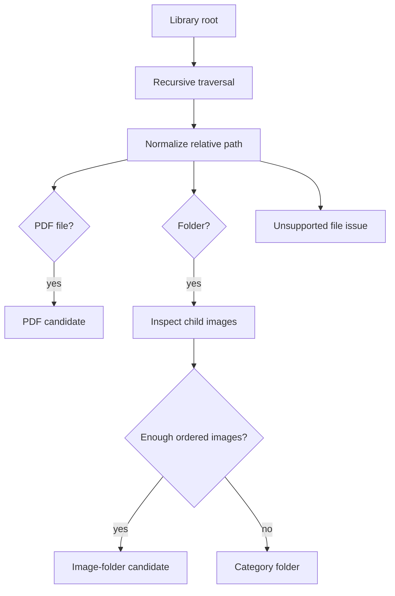

# Purpose

Define the recursive scanner that traverses the library root and produces normalized book candidates.

# Background

Users organize libraries naturally through folders. The scanner must be conservative, deterministic, and safe. It should handle PDFs, image folders, nested categories, hidden files, partially synced Google Drive placeholders, and unsupported files without damaging the user’s structure.

# Requirements

- Traverse the library root recursively.
- Produce relative paths only.
- Detect PDF files by extension and, when practical, file signature.
- Detect image folders by supported image extensions and page count thresholds.
- Use deterministic natural sorting for image pages.
- Avoid treating every category folder as a book.
- Skip unsupported, temporary, hidden, and system files according to policy.
- Record recoverable errors as scan issues.
- Be cancellable and incremental.

# Responsibilities

- Enumerate filesystem entries efficiently.
- Normalize and validate paths.
- Produce candidate records for discovery.
- Avoid metadata extraction concerns beyond candidate-level fingerprinting.

# Architecture

The scanner should be a low-level infrastructure service implementing an application port. It should not write final book records directly. It returns scan events or candidate batches to the application layer, which applies discovery policies and persists results transactionally.

# Mermaid Diagram

# Data Model

Scanner output shape:

- `candidate_kind`: `pdf_file` or `image_folder`.
- `relative_path`: normalized path to PDF file or folder.
- `child_files`: page paths for image folders.
- `fingerprint`: size, modified timestamp, optional hash.
- `warnings`: non-fatal issues such as unreadable files.
- `source_depth`: depth from root for category inference.

# Future Extension

- Add archive-book detection for `.cbz` and `.zip`.
- Add EPUB detection.
- Add scanner plugin hooks for custom book types.
- Add content hashing in a lower-priority background job.

# Settled M1 policy

- Supported image extensions are `jpg`, `jpeg`, `png`, and `webp`.
- Two direct supported images make a folder eligible.
- Each eligible nested folder is an independent book; parent folders do not
  absorb descendant pages.
- Symlinks are not followed and cloud-only entries are cataloged as unavailable.

See ADR-008.
