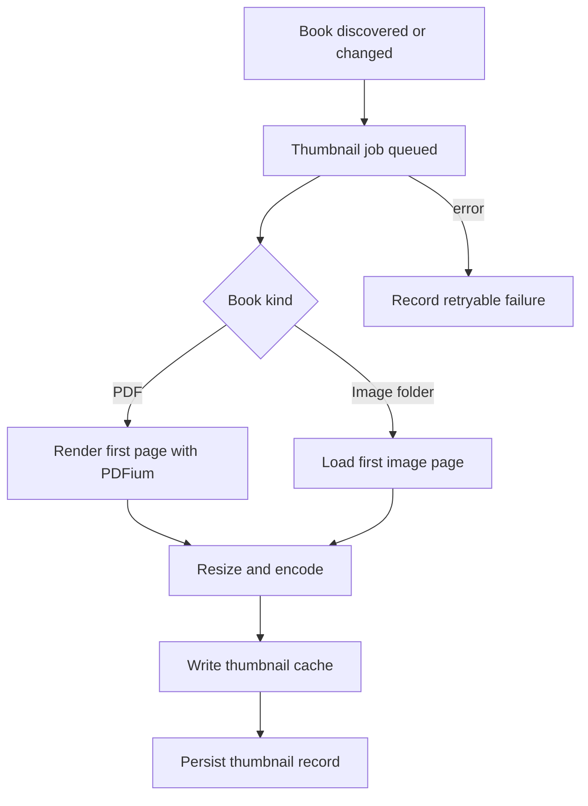

# Purpose

Define thumbnail generation, caching, invalidation, and retrieval for discovered books.

# Background

Thumbnails make browsing pleasant but are derived artifacts. They must never be treated as source content. PDF thumbnails should come from the first meaningful page through PDFium. Image-folder thumbnails should come from the first readable page image.

# Requirements

- Generate thumbnails asynchronously after discovery.
- Cache thumbnails using relative or app-data-safe references.
- Do not modify original book files.
- Invalidate thumbnails when source fingerprints change.
- Support failure state without breaking book browsing.
- Prefer deterministic sizes and formats for UI performance.
- Allow regeneration on demand.
- Report explicit retry stages without exposing absolute source paths.

# Responsibilities

- Produce visual previews for catalog browsing.
- Avoid blocking scanning and reader workflows.
- Track generation status and errors.
- Keep cache cleanup possible.

# Architecture

Thumbnail generation should run as a background job. The application layer selects books needing thumbnails. Infrastructure adapters render or load the first page, resize it, write a cache file, and persist the thumbnail record. UI reads thumbnail status through catalog queries.

An explicit Book Detail retry emits typed progress for opening the source,
rendering the first page, saving the app-data cover, and completion. Opening the
source is the step that asks a cloud filesystem provider to hydrate an
online-only file. The UI keeps these stage messages visible on success or
failure so the user can identify where an attempt stopped.

# Mermaid Diagram

# Data Model

Thumbnail tables:

- `thumbnails(id, book_id, cache_relative_path, width, height, format, source_fingerprint, status, error_message, generated_at)`
- `thumbnail_jobs(id, book_id, status, attempt_count, priority, last_error, created_at, updated_at)`

If cache files are stored outside the library root in app data, `cache_relative_path` should be relative to the app cache root, not an absolute OS path.

# Future Extension

- Multiple thumbnail sizes for list, grid, and detail views.
- User-selected cover image.
- PDF page selection for cover.
- Perceptual placeholder colors generated from cover thumbnails.

# Settled M1 policy

- Thumbnails are bounded 320-by-448 PNG files in app cache, never in the library
  root.
- Fingerprint changes invalidate cached covers. Explicit Repair preserves every
  usable current cover and retries only books without one.
- A failed cover remains a browsable book with an error state and may retry on
  rescan or repair.
- Only the first decoded frame is used for supported image formats.
- PDFium rendering is serialized because its native library is not treated as
  concurrently re-entrant.
- The PDFium binding is initialized once per app process and reused; each cover
  opens and closes its own document and page state.

See ADR-008.
