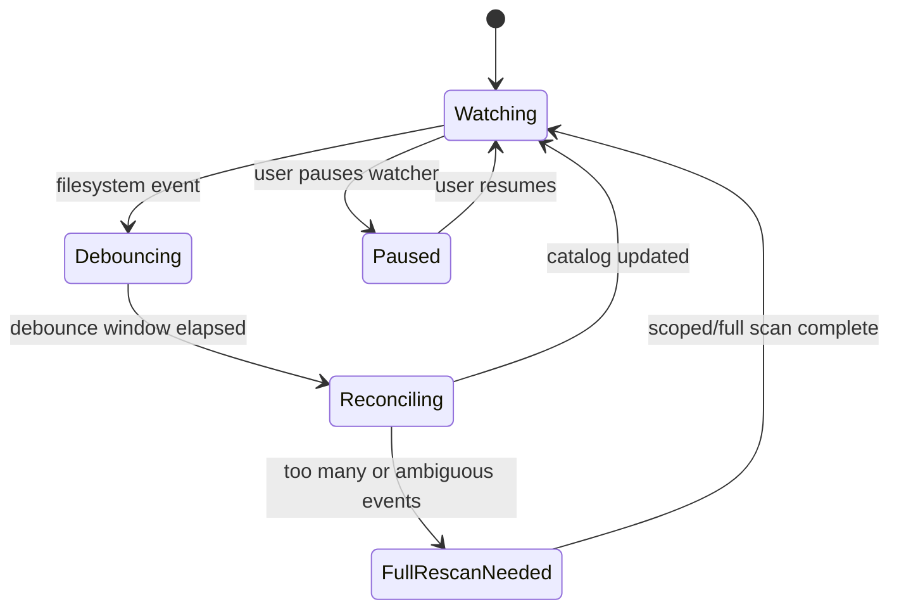

# Purpose

Define filesystem watching behavior after library initialization.

# Background

Users may add, delete, rename, or edit files outside Book Library using File Explorer, download tools, Google Drive Desktop, or other applications. The watcher keeps the catalog fresh without requiring constant full rescans.

# Requirements

- Watch the configured library root for changes.
- Debounce bursts of filesystem events.
- Reconcile creates, updates, deletes, and renames.
- Fall back to scoped rescan when events are ambiguous.
- Avoid corrupting state during Google Drive Desktop sync churn.
- Persist enough job state to recover after app restart.
- Allow the user to pause or manually trigger scans.

# Responsibilities

- Observe filesystem changes.
- Convert noisy native events into stable reconciliation jobs.
- Keep book availability and metadata current.
- Avoid blocking reader and notes workflows.

# Architecture

The watcher is an infrastructure adapter. It emits normalized events to the application layer. The application layer batches events and schedules discovery or missing-file reconciliation. The watcher should not decide final book identity by itself.

# Mermaid Diagram

# Data Model

Watcher-related records:

- `filesystem_events(id, library_id, relative_path, event_kind, observed_at, processed_at)`
- `reconciliation_jobs(id, library_id, scope_relative_path, status, reason, created_at, updated_at)`
- `books.status`: set to `missing` when source disappears after verification.
- `scan_jobs.reason`: `initial`, `manual`, `watcher`, `recovery`.

# Future Extension

- Conflict-aware sync support when metadata files are also stored in Google Drive.
- User notifications for large external changes.
- Ignore rules similar to `.gitignore`.
- Watcher health diagnostics.

# Open Questions

- Which native watcher crate should be used with Tauri 2 on Windows?
- How long should debounce windows be for Google Drive Desktop folders?
- Should the watcher run immediately on app launch or after a quick startup scan?
