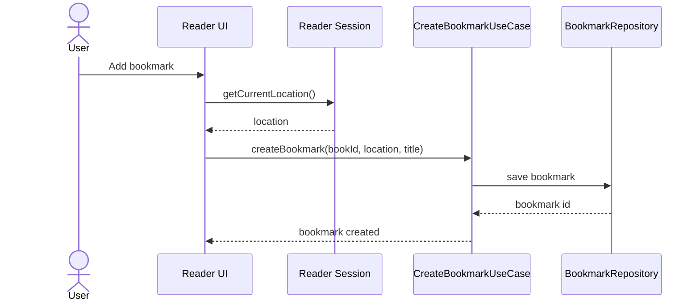

# Purpose

Define bookmark behavior across PDF and image-folder books.

## Status

**Deferred by ADR-009.** Embedded-reader bookmarks are not part of the current
roadmap.

# Background

Bookmarks let the user save important reading locations without modifying source books. They should be simple, local, durable, and searchable. Bookmarks must work across reader types while allowing reader-specific location payloads.

# Requirements

- Create bookmarks from the current reader location.
- Support optional title and note text.
- Persist bookmarks in SQLite.
- Store locations in a reader-agnostic base shape plus reader-specific payload.
- Show bookmarks per book and in global search.
- Keep bookmarks when source files are temporarily missing.
- Never write bookmarks into PDF files or image folders.

# Responsibilities

- Provide durable reading anchors.
- Support navigation back to saved locations.
- Integrate with reading history and notes.
- Provide enough data for future export.

# Architecture

Bookmark creation is an application use case invoked by the reader UI. The active reader session provides a `ReadingLocation`. The application validates the book, persists the bookmark, and optionally links it to a Markdown note.

# Mermaid Diagram

# Data Model

Bookmark table:

- `bookmarks(id, book_id, title, note, page_index, progress, location_payload, created_at, updated_at)`
- `location_payload` examples: PDF viewport coordinates, image scroll offset, future text anchor.
- Indexes: `book_id`, `created_at`, optional FTS projection for title and note.

# Future Extension

- Bookmark folders or labels.
- Export bookmarks to Markdown.
- Link bookmarks to highlights and note blocks.
- Shareable bookmark references using relative path plus location.

# Open Questions

- Should bookmarks support colors in the first version?
- Should anonymous bookmarks be auto-titled from page number?
- Should bookmark notes live in SQLite only or also sync into Markdown frontmatter?
