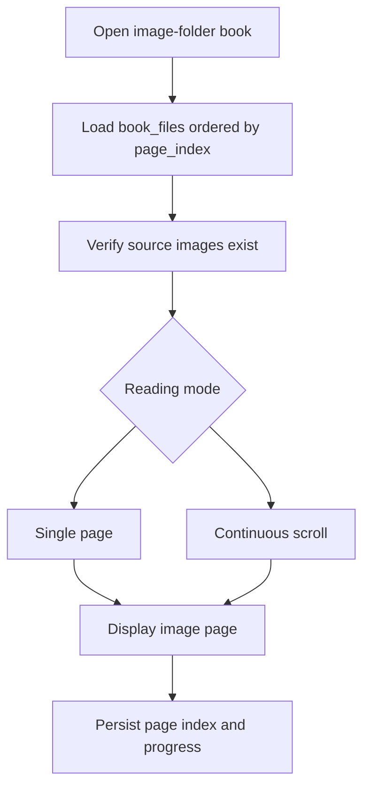

# Purpose

Define the image-folder reader for manga, scanned documents, and folders of ordered page images.

## Status

**Deferred by ADR-009.** Current M2 opens the cataloged image directory in the
OS file manager. The embedded-reader design below is retained only as a possible
future extension and is not an active product requirement.

# Background

The user stores manga and image-based books as folders containing numbered files such as `001.png`, `002.png`, and so on. These folders should behave like books without requiring conversion to PDF or archive formats.

# Requirements

- Open image-folder books discovered from the library root.
- Use natural sort order for page files.
- Support single-page and continuous reading modes.
- Support zoom, fit-width, fit-height, and rotation.
- Restore reading position by page index.
- Detect missing or unreadable page files.
- Avoid writing to source folders.
- Support common formats such as PNG and JPEG in the first release.

# Responsibilities

- Map folder contents to stable page sequences.
- Provide page image loading to the frontend.
- Track reading progress consistently with PDF books.
- Handle partially missing image folders gracefully.

# Architecture

The image reader shares the generic reader interface with PDF reader but uses `book_files` records for page order. It should prefer cataloged page records generated by scanner discovery, then verify availability when opening.

# Mermaid Diagram

# Data Model

Image reader records:

- `books.kind = 'image_folder'`.
- `book_files.page_index`: deterministic natural sort index.
- `book_files.relative_path`: page image path relative to library root.
- `book_files.media_type`: image MIME type.
- `reading_state.page_index`: current image index.
- `bookmarks.location_payload`: page index plus optional scroll position.

# Future Extension

- WebP, AVIF, TIFF, and GIF support.
- Right-to-left manga reading mode.
- Double-page spread mode.
- Chapter navigation for nested folders.
- Archive formats such as CBZ and CBR.

# Open Questions

- Should folder names such as `cover.jpg` be excluded from page order automatically?
- Should very large images be downsampled into a cache for smoother reading?
- How should nested chapter folders display in the reader navigation?
