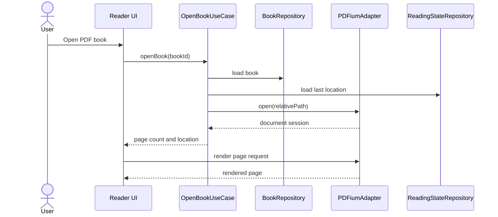

# Purpose

Define the PDF reader module for rendering, navigating, bookmarking, and tracking progress in PDF books.

# Background

PDF files are a primary book type. The reader must be fast, stable, and isolated from catalog concerns. PDFium is the chosen rendering engine, but the rest of the application should depend on reader contracts rather than PDFium-specific details.

# Requirements

- Open PDF books by resolving relative paths at runtime.
- Render pages through PDFium.
- Support page navigation, zoom, fit modes, and rotation.
- Restore the last reading location.
- Report page count and basic document metadata.
- Support bookmark creation at page-level locations.
- Avoid writing to source PDF files.
- Handle password-protected, corrupt, missing, and unsupported PDFs gracefully.

# Responsibilities

- Provide renderable page output to the frontend.
- Translate PDF coordinates and page indexes into app reading locations.
- Expose document metadata for catalog enrichment when safe.
- Keep PDFium errors contained and user-readable.

# Architecture

The PDF reader should implement a generic reader port. The application layer asks for a document session using a book ID. The adapter resolves the path, opens PDFium, prepares page metadata, and streams render results or page images to the UI through Tauri-safe mechanisms.

# Mermaid Diagram

# Data Model

PDF reader records:

- `books.kind = 'pdf_file'`.
- `reading_state.location_payload`: optional JSON containing PDF zoom, layout, page index, and anchor data.
- `bookmarks.location_payload`: page index and optional viewport coordinates.
- `book_metadata.page_count`: extracted page count.
- `reader_errors`: optional diagnostic records for failed opens.

# Future Extension

- Text selection and copy.
- Highlight annotations stored separately from the PDF.
- Page text extraction for indexing.
- Password prompt and secure temporary session handling.
- Side-by-side note panel anchored to selected text.

# Open Questions

- Should rendering produce images in Rust or expose PDFium output through a webview-compatible bridge?
- Should PDF text extraction be part of the reader module or search indexing module?
- Should password-protected PDFs be supported in the first release?
