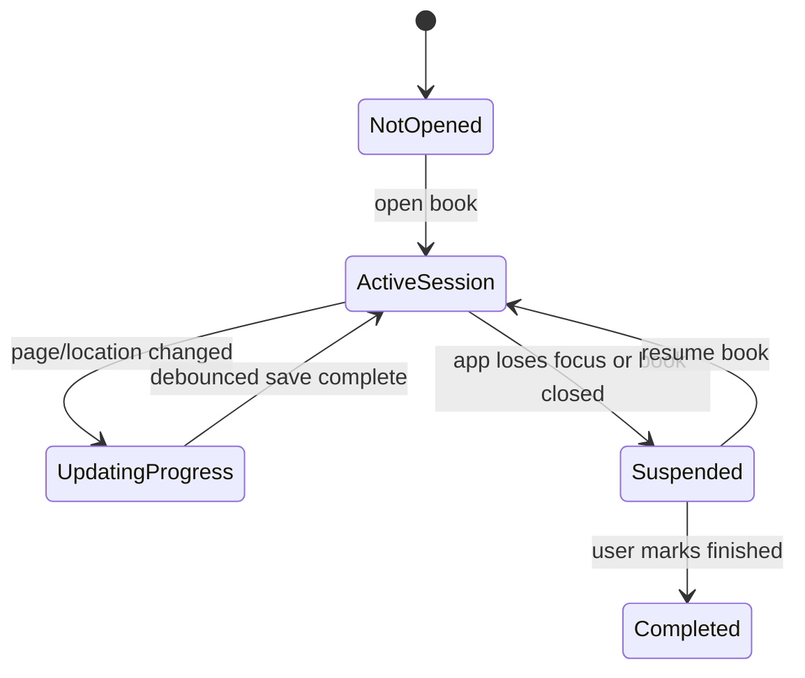

# Purpose

Define reading history, progress restoration, and session tracking.

# Background

A personal reading platform should remember what the user was reading, where they stopped, and how their reading activity evolves over time. This state belongs in SQLite because it is operational metadata, not source book content.

# Requirements

- Persist current reading location per book.
- Track reading sessions with start and end timestamps.
- Update progress without excessive database writes.
- Support recent books view.
- Preserve history when source files become temporarily missing.
- Keep reader-specific payloads extensible.

# Responsibilities

- Restore reading context quickly.
- Power recent activity and progress UI.
- Provide future statistics and reading goals.
- Keep history separate from bookmarks and notes.

# Architecture

The reader UI emits location changes through throttled updates. The application layer records current state and appends session summaries. Writes should be debounced to avoid database churn during scrolling.

# Mermaid Diagram

# Data Model

Reading tables:

- `reading_state(book_id, page_index, progress, location_payload, updated_at)`
- `reading_history(id, book_id, started_at, ended_at, start_page_index, end_page_index, duration_seconds)`
- `reading_events(id, book_id, event_kind, page_index, created_at)` optional for future analytics.

# Future Extension

- Reading goals and streaks.
- Time-per-book analytics.
- Finished/abandoned status.
- Sync-safe reading state export.

# Open Questions

- Should progress be based on page index, scroll offset, or normalized ratio?
- How often should active reading state be flushed to SQLite?
- Should history be user-editable?
