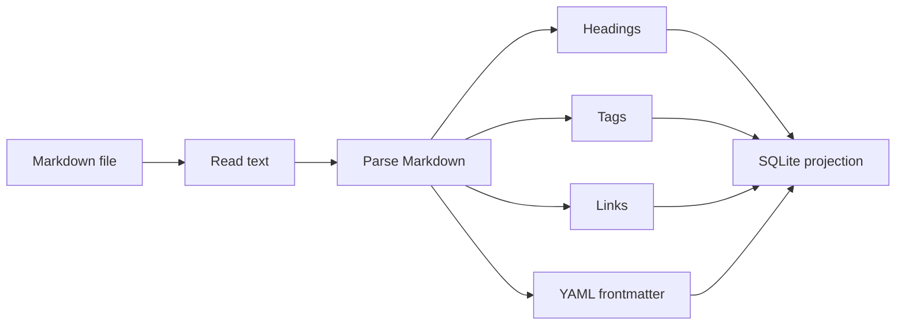

# Purpose

Define Markdown formatting conventions and parsing rules.

# Background

Markdown must remain portable. Book Library should support useful conventions without inventing a complex dialect. Obsidian compatibility is important, but the app should degrade gracefully when users write ordinary Markdown.

# Requirements

- Support CommonMark-compatible Markdown as the baseline.
- Support YAML frontmatter when present.
- Support Obsidian-style wiki links such as `[[Note Title]]`.
- Support relative Markdown links such as `[label](../path/file.md)`.
- Avoid hidden binary state in note files.
- Preserve user formatting as much as possible when editing.
- Parse links, headings, tags, and frontmatter for indexing.

# Responsibilities

- Define supported Markdown features.
- Guide note creation templates.
- Prevent accidental lock-in through custom syntax.
- Support search, backlinks, and book associations.

# Architecture

The Markdown adapter should separate read/parse/write responsibilities. A parser can build projections for SQLite without rewriting the file. A writer should be conservative and used mainly for note creation or explicit metadata updates.

# Mermaid Diagram

# Data Model

Parsed note projection:

- `notes.title`: first heading or filename fallback.
- `note_headings(note_id, heading_text, slug, level, position)`.
- `note_tags(note_id, tag)`.
- `note_links(source_note_id, target_ref, target_kind, resolved_note_id)`.
- `note_frontmatter(note_id, key, value)`.

# Future Extension

- Callouts compatible with Obsidian.
- Block references for precise links.
- Mermaid rendering inside notes.
- Math support through KaTeX or MathJax.

# Open Questions

- Should Markdown parsing happen in Rust or TypeScript?
- Should the app auto-repair broken wiki links after note rename?
- Should frontmatter updates preserve comments and ordering?
