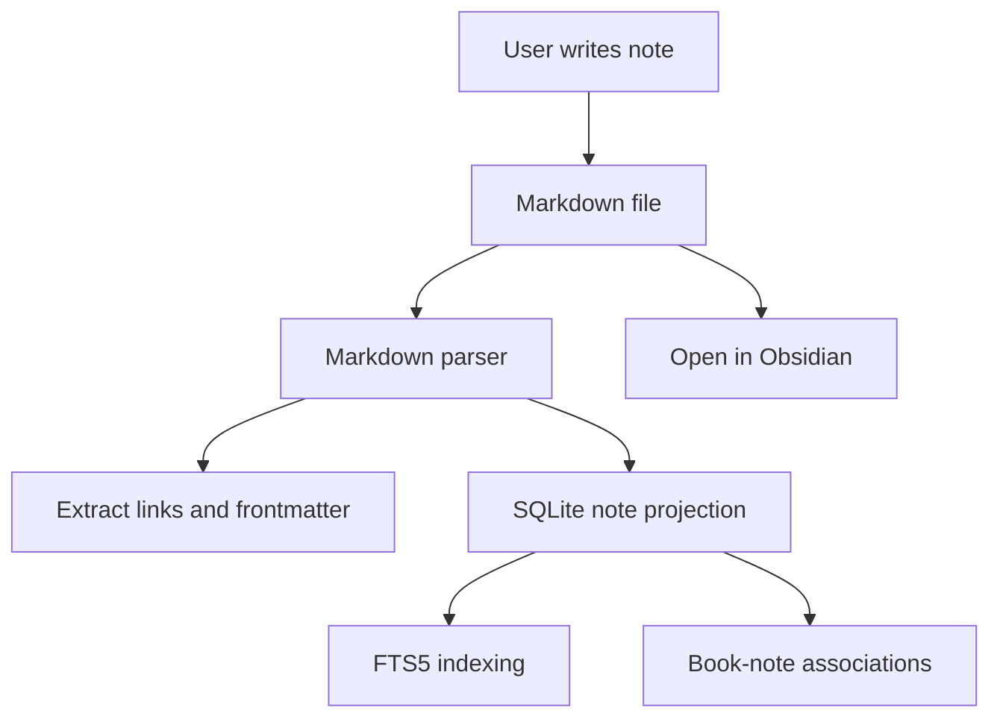

# Purpose

Define the notes system for Book Library.

# Background

Notes are central to transforming a reader into a knowledge platform. They must remain plain Markdown files, compatible with Obsidian, and useful even if Book Library is uninstalled. SQLite may index and link notes, but it must not become the canonical store for note text.

# Requirements

- Store notes as Markdown files.
- Use relative paths for note references.
- Associate notes with books, bookmarks, pages, and topics.
- Allow notes to be opened and edited from the app.
- Keep note files readable by Obsidian and any text editor.
- Maintain note metadata in SQLite as an index/cache.
- Avoid proprietary note formats.

# Responsibilities

- Create and locate Markdown notes.
- Maintain book-note associations.
- Parse links and metadata for search and navigation.
- Preserve user-authored text as filesystem content.

# Architecture

The notes module should use Markdown files as source content and SQLite as a projection. The application layer creates note paths according to policy. The Markdown adapter reads, writes, and parses notes. Search indexing consumes parsed note text.

# Mermaid Diagram

# Data Model

Note tables:

- `notes(id, relative_path, title, note_kind, fingerprint, created_at, updated_at)`
- `book_note_links(id, book_id, note_id, relation_kind, location_payload)`
- `note_links(id, source_note_id, target_kind, target_ref, link_text)`
- `note_frontmatter(note_id, key, value)` optional projection.

# Future Extension

- Templates for book notes, literature notes, permanent notes, and daily notes.
- Backlink graph visualization.
- Embedded excerpts from bookmarks and highlights.
- Note refactoring tools for renaming and moving Markdown files.

# Open Questions

- Should the default notes folder be `Notes/`, `.book-library/notes/`, or configurable?
- Should note editing happen inside the app, external editor, or both?
- Should frontmatter be required for book-note associations or inferred from SQLite links?
