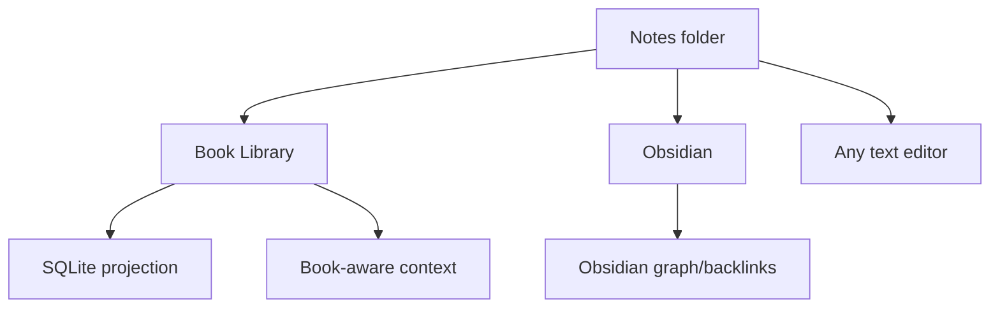

# Purpose

Define Obsidian compatibility expectations for notes created and managed by Book Library.

# Background

Obsidian is a powerful local Markdown knowledge tool. Book Library should complement it rather than compete directly with every Obsidian feature. Notes should be usable in Obsidian as a vault or part of a vault without requiring conversion.

# Requirements

- Use plain Markdown files.
- Support relative links and wiki links.
- Avoid app-only syntax for core relationships.
- Keep file and folder naming compatible with Obsidian.
- Store optional metadata in YAML frontmatter when useful.
- Allow the notes directory to be opened externally.
- Do not require Obsidian to be installed.

# Responsibilities

- Preserve note portability.
- Define link conventions between notes and books.
- Clarify what Obsidian features are supported, ignored, or future work.
- Keep SQLite projections rebuildable from Markdown when possible.

# Architecture

Book Library should treat Obsidian as an external peer application. It writes and reads files in a compatible form. SQLite can maintain richer relationships for UI speed, but Markdown remains the durable text. Book-specific links can use frontmatter plus readable Markdown links.

# Mermaid Diagram

# Data Model

Suggested frontmatter for book notes:

- `book_relative_path`: relative path to the book file or image folder.
- `book_id`: optional app ID, not required for portability.
- `title`: note title when not derived from heading.
- `tags`: Obsidian-compatible tag list.
- `created`: ISO timestamp.
- `updated`: ISO timestamp if the app updates it.

# Future Extension

- Open current note in Obsidian command.
- Generate `.obsidian`-compatible optional workspace settings.
- Backlink graph view inside Book Library.
- Bidirectional sync of selected metadata through frontmatter.

# Open Questions

- Should `book_id` appear in frontmatter if it is app-specific?
- Should Book Library create an Obsidian vault by default or just a compatible folder?
- Should wiki links resolve by note title, file stem, or full relative path?
