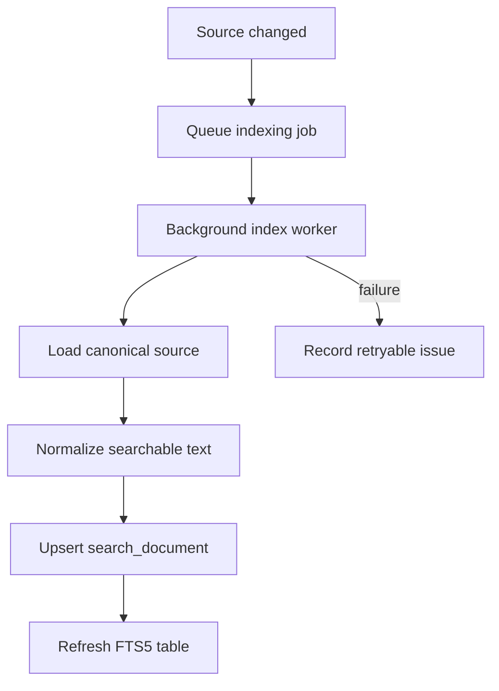

# Purpose

Define indexing workflows that keep search projections current.

# Background

Search indexing is derived work. It should run in the background, tolerate failures, and rebuild from source records and files. Indexing may cover simple metadata early and OCR text later.

# Requirements

- Index changed books, notes, bookmarks, and OCR outputs.
- Queue indexing jobs after discovery, note changes, bookmark updates, and OCR completion.
- Make jobs idempotent.
- Support rebuilding the entire index.
- Track indexing failures without breaking core use.
- Avoid blocking UI flows.

# Responsibilities

- Convert source entities into search documents.
- Maintain FTS projections.
- Provide progress and diagnostics.
- Keep search results fresh enough for desktop use.

# Architecture

Indexing jobs should be stored in SQLite and processed by a background worker. Each job loads the canonical source, builds normalized text, updates the search document, and refreshes the FTS projection inside a transaction.

# Mermaid Diagram

# Data Model

Indexing records:

- `search_index_jobs(id, source_kind, source_id, status, attempt_count, priority, last_error, created_at, updated_at)`
- `search_documents(id, source_kind, source_id, scope, title, body, relative_path, content_hash, updated_at)`
- `search_index_runs(id, reason, started_at, finished_at, indexed_count, failed_count)`

# Future Extension

- Incremental page-level indexing.
- Pluggable token normalization.
- Embedding generation jobs as optional semantic search module.
- Index compaction and optimization scheduling.

# Open Questions

- Should note file watching trigger indexing independently from library watching?
- How should indexing prioritize visible/recent books?
- Should failed jobs retry with exponential backoff?
