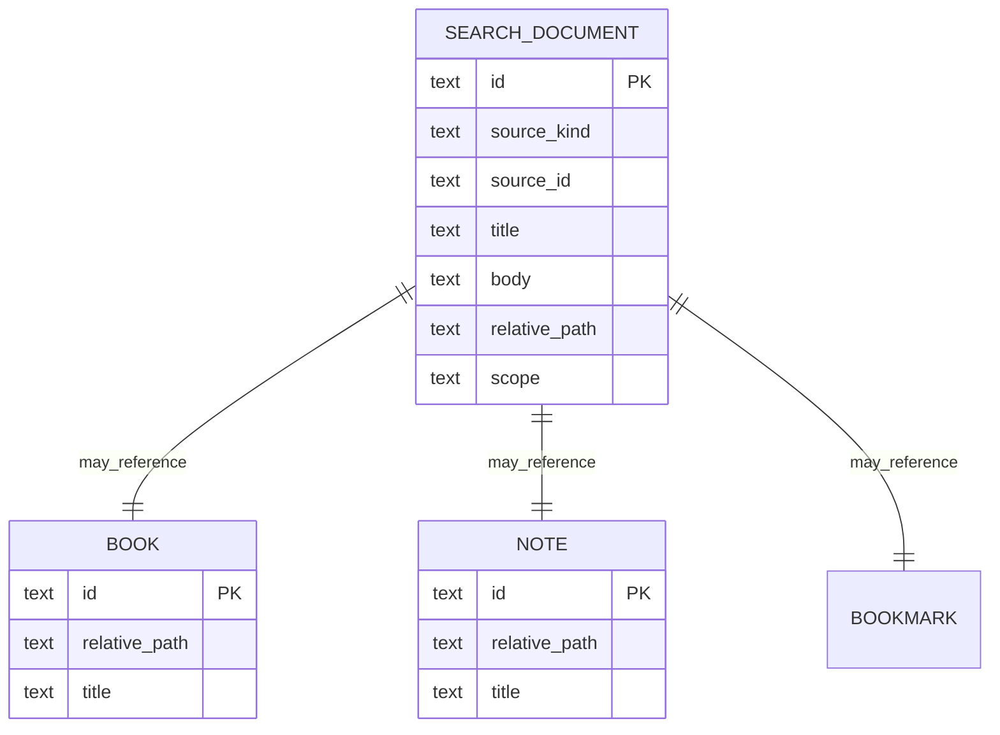

# Purpose

Define SQLite FTS5 usage for offline full-text search.

# Background

Search must work offline across book metadata, Markdown notes, bookmarks, and eventually OCR/text extraction. SQLite FTS5 is available locally, lightweight, and suitable for a desktop-first application.

# Requirements

- Use SQLite FTS5 for full-text search.
- Index metadata, notes, bookmarks, and future OCR text as separate scopes.
- Support prefix, phrase, and ranked search where practical.
- Return snippets and source references.
- Keep FTS tables rebuildable from canonical sources.
- Avoid making FTS content the only copy of note or book text.

# Responsibilities

- Provide fast local search.
- Define FTS table structure and synchronization behavior.
- Separate indexing from querying.
- Support future search scopes without schema chaos.

# Architecture

FTS should be a projection layer. Indexing jobs build or update search documents from books, notes, bookmarks, and OCR outputs. Query use cases search FTS tables and join back to source records for display.

# Mermaid Diagram

# Data Model

Potential FTS structure:

- `search_documents(id, source_kind, source_id, scope, title, body, relative_path, updated_at)`
- `search_documents_fts` virtual table using FTS5 with `title`, `body`, and external content linkage.
- `search_index_jobs(id, source_kind, source_id, status, reason, created_at, updated_at)`

Scopes:

- `catalog`: titles, paths, metadata.
- `notes`: Markdown note text.
- `bookmarks`: bookmark titles and notes.
- `ocr`: OCR page text.

# Future Extension

- Semantic search as an optional module.
- Field-weighted ranking.
- Saved searches and smart collections.
- Query suggestions based on indexed terms.

# Open Questions

- Should FTS tables use external content mode from the start?
- Which tokenizer should be used for multilingual collections?
- Should OCR text be indexed per page or per book-level document?
