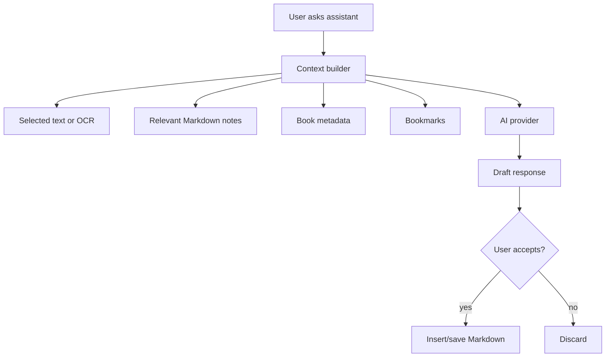

# Purpose

Define the optional AI assistant module for reading and knowledge workflows.

# Background

AI can help summarize, explain, translate, extract flashcards, and connect notes. However, the product must remain fully useful without AI. AI features should be permissioned, transparent, and built on top of explicit user context rather than hidden uploads.

# Requirements

- AI assistant must be optional and disabled until configured.
- No core reading, scanning, notes, or search workflow may require AI.
- User must understand what content is sent to any external model.
- Assistant context should come from selected text, current page OCR/text, notes, bookmarks, and metadata.
- AI outputs should be drafts until accepted by the user.
- Support local or remote model providers in the architecture.
- Persist conversations only if the user chooses to save them.

# Responsibilities

- Provide reading assistance without owning core data.
- Generate summaries, explanations, translations, tags, and note drafts.
- Help create Anki card drafts.
- Respect privacy and local-first expectations.

# Architecture

The AI assistant should be a module using a provider abstraction. A context builder assembles explicit context from local sources. The provider returns responses. The user can copy, insert into notes, save as Markdown, or discard outputs.

# Mermaid Diagram

# Data Model

AI records:

- `ai_providers(id, name, provider_kind, enabled, config_json)`
- `ai_conversations(id, title, source_book_id, saved, created_at, updated_at)` optional.
- `ai_messages(id, conversation_id, role, content, created_at)` optional.
- `ai_outputs(id, source_kind, source_id, output_kind, content, accepted, created_at)`.

# Future Extension

- Local model support through a provider adapter.
- Retrieval-augmented answers from notes and OCR text.
- Prompt templates for literature review, language learning, and technical study.
- AI-assisted metadata extraction with user review.

# Open Questions

- Which provider abstraction should be implemented first?
- Should AI conversation history be saved by default or ephemeral by default?
- Should semantic search be part of AI assistant or a separate optional search module?
