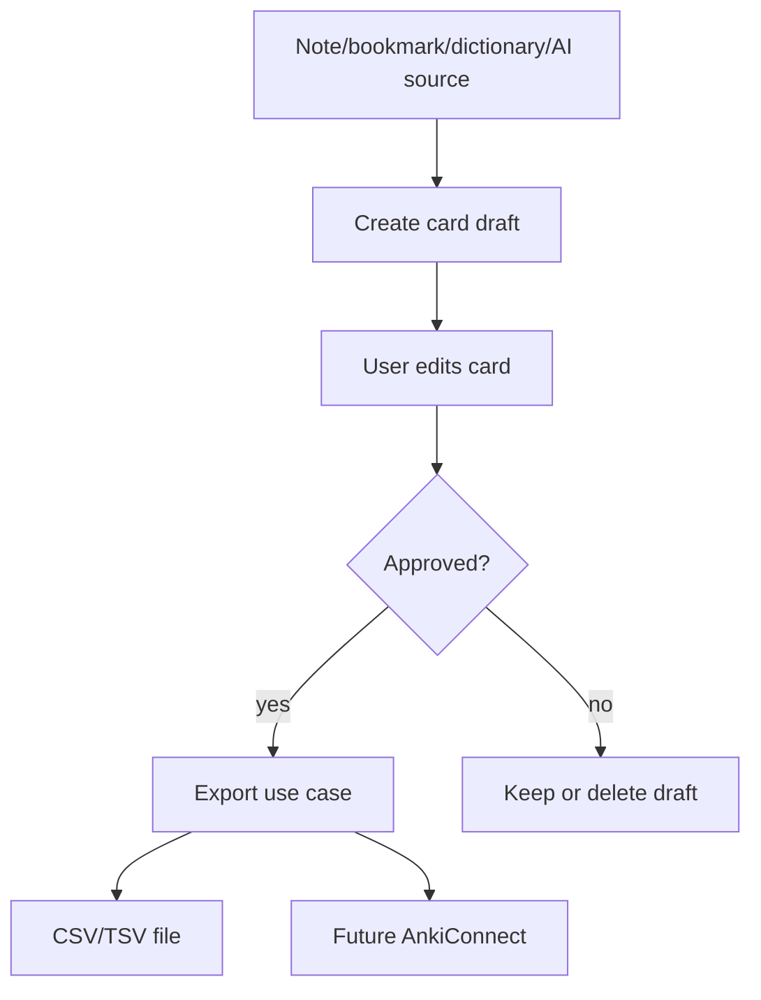

# Purpose

Define Anki export and flashcard generation workflows.

# Background

A personal reading platform can support memory and review by exporting selected definitions, excerpts, questions, and cloze deletions to Anki. This should be optional and should not require Anki for core reading or notes.

# Requirements

- Support creating flashcard drafts from notes, bookmarks, dictionary lookups, OCR text, or AI outputs.
- Keep card drafts editable before export.
- Export approved drafts as UTF-8 TSV first.
- Support AnkiConnect later as an optional integration.
- Preserve source references back to book relative path and page location.
- Avoid sending content externally unless AI generation is explicitly used.

# Responsibilities

- Convert reading knowledge into reviewable cards.
- Track source provenance for cards.
- Provide export formats that do not lock users into Book Library.
- Integrate with AI assistant only as an optional generator.

# Architecture

Anki support should be a module that consumes source selections and creates `anki_card_drafts`. Export use cases transform approved drafts into CSV/TSV or send them through a configured provider such as AnkiConnect.

The initial export is a user-selected UTF-8 TSV file with deterministic field
escaping and a documented column order. Drafts remain editable SQLite
application state; they are not written into Markdown automatically. A note
insertion is a separate explicit action using the existing conservative
Markdown workflow.

Every OCR/dictionary draft preserves the book relative path, page index,
dictionary package/entry provenance, and optional bounded derived crop. Export
reports per-card failures and never marks a draft exported unless its row was
written successfully.

ADR-014 fixes the initial columns as `front`, `back`, `tags`, and `source`.
Export creates a new file, includes a UTF-8 BOM for importer compatibility, and
refuses silent overwrite. Only drafts in `approved` state are written; a
successful export advances those drafts to `exported`.

# Mermaid Diagram

# Data Model

Anki records:

- `anki_card_drafts(id, source_kind, source_id, front, back, tags, deck_name, note_type, status, created_at, updated_at)`
- `anki_exports(id, export_kind, target, status, exported_count, created_at)`
- `anki_export_items(export_id, card_draft_id, status, error_message)`

# Future Extension

- AnkiConnect direct deck sync.
- Cloze deletion helper.
- AI-generated cards with review queue.
- Spaced-repetition status imported back into Book Library.

# Open Questions

- Should tags include book folder hierarchy by default?
- Which minimal TSV field set and HTML/media convention should the first Anki
  import profile support?
- Should successful exports retain immutable snapshots for audit/re-export or
  only export history and draft identifiers?
