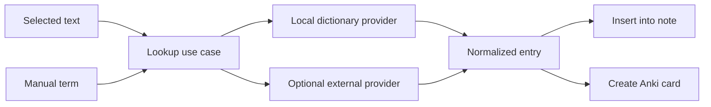

# Purpose

Define optional dictionary and lookup features for reading workflows.

# Background

Dictionary lookup is useful for language learning and technical reading. It can be implemented locally with dictionary files or externally through APIs. The architecture should allow both while keeping the reader useful without dictionary setup.

# Requirements

- Dictionary support must be optional.
- Support lookup from selected text when text is available.
- Support manual lookup from a search box.
- Allow local dictionary providers.
- Allow external providers only with explicit configuration.
- Keep lookup history disabled by default; save it only after explicit opt-in
  and provide clear-history behavior.
- Support exporting selected terms to Anki module.
- Preserve source package name, version, entry identifier, and license
  provenance in normalized results and learning drafts.

# Responsibilities

- Resolve terms to definitions, examples, and pronunciation metadata when available.
- Keep provider-specific details outside the reader UI.
- Protect offline-first behavior by preferring local providers.
- Integrate with notes and Anki as optional workflows.

# Architecture

A dictionary module implements a `DictionaryProvider` port. The reader or note UI invokes a lookup use case. The use case queries enabled providers and returns normalized dictionary entries.

M6 starts with a local Japanese provider and manual lookup, independent of OCR.
Japanese tokenization/morphological analysis is exposed through a separate
application-owned port because suggested token boundaries may be ambiguous and
must remain user-correctable. OCR blocks, pasted text, and manual terms all call
the same lookup use case.

Candidate dictionary, Kanji, frequency, Vietnamese, and Hán-Việt datasets must
pass a redistribution-license, attribution, versioning, checksum, update, and
package-size review before an ADR selects the initial bundle. Data imported into
SQLite is a rebuildable index; the versioned source package and its notices
remain identifiable.

ADR-014 supplies an original CC0 starter package so lookup works without a
download. It is intentionally small and is not represented as comprehensive.
Users may explicitly import a UTF-8 TSV package with this required header:

```text
expression	reading	part_of_speech	meaning_vi	han_viet
```

The importer requires a declared package name, version, and license/provenance,
bounds file and row sizes, validates all rows before writing, records a
deterministic checksum, and commits the package transactionally.

ADR-015 also accepts explicitly selected Yomitan term-dictionary ZIP packages.
The importer reads `index.json` and root `term_bank_<number>.json` members
without extracting them, derives the package title and revision, and converts
textual glossary content to plain text. Archive/file/entry limits are checked
before the transaction commits. Entries with no usable textual definition are
skipped and counted in the import result instead of rejecting the whole valid
package. The UI still requires a user-declared license or provenance label;
importing does not grant redistribution rights and the app does not bundle or
download community dictionary data.

Lookup input uses the same Japanese-aware whitespace normalization as OCR.
This permits a recognized page excerpt to be looked up without failing only
because Tesseract inserted spaces between Japanese terms.
Selecting a bounded term directly in rendered OCR text triggers the same lookup
immediately and updates the adjacent dictionary results without a separate
button press.

For large packages, longest-known-term candidates are filtered by the current
query in SQLite. A lookup does not load every installed expression into memory.

# Mermaid Diagram



# Data Model

Dictionary records:

- `dictionary_providers(id, name, provider_kind, enabled, config_json)`
- `dictionary_packages(id, provider_id, package_version, checksum, license_id, installed_at)`
- `dictionary_entries(id, package_id, external_entry_id, expression, reading, normalized_json)`
- rebuildable lookup indexes for expressions, readings, and Kanji;
- `dictionary_lookup_history(id, term, provider_id, result_json, created_at)` optional.
- `anki_card_drafts.source_kind = 'dictionary_lookup'` for exports.

# Future Extension

- Starred vocabulary list.
- Frequency lists and learning status.
- Multi-language morphological analysis.
- Offline dictionary package manager.

# Open Questions

- Which licensed Vietnamese and Hán-Việt datasets meet redistribution and
  quality requirements?
- Which tokenizer provides acceptable cross-platform package size and Japanese
  segmentation quality?
- Should dictionary package updates be manual-only in the first M6 release?
