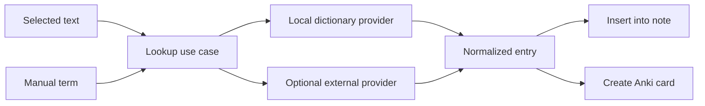

# Purpose

Define optional dictionary and lookup features for reading workflows.

# Background

Dictionary lookup is useful for language learning and technical reading. It can be implemented locally with dictionary files or externally through APIs. The architecture should allow both while keeping the reader useful without dictionary setup.

# Requirements

- Dictionary support must be optional.
- Support lookup from selected text when text is available.
- Support manual lookup from a search box.
- Allow local dictionary providers.
- Allow external providers only with explicit configuration.
- Save lookup history only if the user enables it.
- Support exporting selected terms to Anki module.

# Responsibilities

- Resolve terms to definitions, examples, and pronunciation metadata when available.
- Keep provider-specific details outside the reader UI.
- Protect offline-first behavior by preferring local providers.
- Integrate with notes and Anki as optional workflows.

# Architecture

A dictionary module implements a `DictionaryProvider` port. The reader or note UI invokes a lookup use case. The use case queries enabled providers and returns normalized dictionary entries.

# Mermaid Diagram

# Data Model

Dictionary records:

- `dictionary_providers(id, name, provider_kind, enabled, config_json)`
- `dictionary_lookup_history(id, term, provider_id, result_json, created_at)` optional.
- `anki_card_drafts.source_kind = 'dictionary_lookup'` for exports.

# Future Extension

- Starred vocabulary list.
- Frequency lists and learning status.
- Multi-language morphological analysis.
- Offline dictionary package manager.

# Open Questions

- Should lookup history be enabled by default?
- Which local dictionary format should be supported first?
- Should dictionary results be cached permanently or treated as transient?
