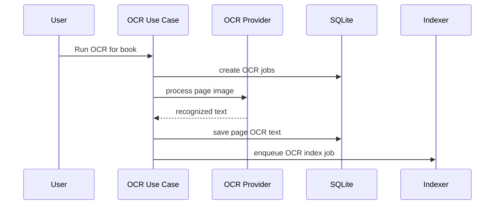

# Purpose

Define optional OCR capabilities for image pages and scanned PDFs.

# Background

OCR can make scanned documents searchable and enable AI-assisted reading. It is computationally expensive and may require external engines or models, so it must remain optional and clearly separated from the core library.

# Requirements

- OCR must be optional and disabled by default unless configured.
- OCR outputs are derived artifacts, not canonical content.
- Support per-book and batch OCR workflows.
- Store OCR text with page-level references.
- Index OCR text through the search pipeline.
- Allow OCR results to be regenerated.
- Clearly communicate whether OCR runs locally or uses an external service.

# Responsibilities

- Extract text from image pages or scanned PDF pages.
- Persist page-level OCR output.
- Feed search and AI assistant modules.
- Respect user privacy and offline-first defaults.

# Architecture

OCR should be an optional module implementing an `OcrProvider` port. The application schedules OCR jobs. The provider processes pages and stores derived text. Search indexing consumes OCR completion events.

# Mermaid Diagram

# Data Model

OCR tables:

- `ocr_jobs(id, book_id, page_index, status, provider_id, attempt_count, last_error, created_at, updated_at)`
- `ocr_pages(id, book_id, page_index, text, confidence, provider_id, source_fingerprint, created_at)`
- `module_settings(module_id='ocr', enabled, config_json)`

# Future Extension

- Local Tesseract provider.
- Local neural OCR provider.
- Layout-aware OCR with blocks and bounding boxes.
- OCR correction workflow using AI assistant.

# Open Questions

- Which OCR provider should be supported first?
- Should OCR text be stored compressed?
- Should OCR run automatically for new image-folder books or only manually?
