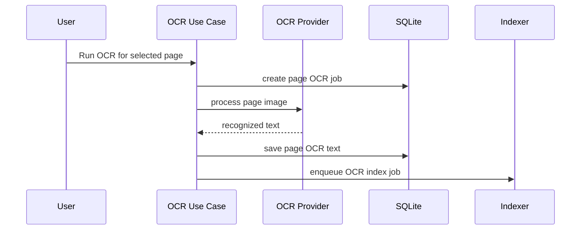

# Purpose

Define optional OCR capabilities for image pages and scanned PDFs.

# Background

OCR can make scanned documents searchable and enable AI-assisted reading. It is computationally expensive and may require external engines or models, so it must remain optional and clearly separated from the core library.

# Requirements

- OCR must be optional and disabled by default unless configured.
- OCR outputs are derived artifacts, not canonical content.
- The first M6 workflow processes one explicitly selected page; per-book and
  batch workflows remain later slices after performance and recovery limits are
  measured.
- Store OCR text with page-level references.
- Preserve recognized blocks, bounding boxes, confidence, provider/model
  version, and source fingerprint when the provider supplies them.
- Index OCR text through the search pipeline.
- Allow OCR results to be regenerated.
- Clearly communicate whether OCR runs locally or uses an external service.
- Normal scanning must never invoke OCR, hydrate a cloud source, or load an OCR
  runtime implicitly.

# Responsibilities

- Extract text from image pages or scanned PDF pages.
- Persist page-level OCR output.
- Feed search and AI assistant modules.
- Respect user privacy and offline-first defaults.

# Architecture

OCR should be an optional module implementing an `OcrProvider` port. The application schedules OCR jobs. The provider processes pages and stores derived text. Search indexing consumes OCR completion events.

The initial provider is the local Tesseract CLI adapter selected by ADR-014. It
uses `BOOK_LIBRARY_TESSERACT` when set and otherwise discovers `tesseract` on the
process path. Missing runtime or Japanese language data makes only the OCR
module unavailable.

This baseline is not the final packaged provider decision. A corpus benchmark
must still cover horizontal prose, vertical manga, furigana, low-contrast scans,
and mixed Japanese/Latin fixtures on Windows 11 x64 and macOS Intel x64 before
OCR features become `Completed`.

Page materialization is a narrow application use case that renders or loads one
selected page into a bounded app-data input. It is not authorization to
implement the deferred embedded reader, navigation, progress, bookmarks, or
source annotations.

# Mermaid Diagram

# Data Model

OCR tables:

- `ocr_jobs(id, book_id, page_index, status, provider_id, attempt_count, last_error, created_at, updated_at)`
- `ocr_pages(id, book_id, page_index, text, confidence, provider_id, provider_version, source_fingerprint, created_at, updated_at)`
- `ocr_blocks(id, ocr_page_id, block_index, text, confidence, x, y, width, height, writing_direction)`
- `module_settings(module_id='ocr', enabled, config_json)`

OCR text and blocks are rebuildable application data. An optional image crop
used by a learning draft is a bounded derived artifact with explicit provenance,
not a replacement for the source page.

The Tesseract adapter removes artificial whitespace adjacent to Japanese
characters before persistence while preserving spaces between Latin words.
It first recognizes a page with horizontal `jpn+eng` and automatic page
segmentation. When mean word confidence is below 65%, it retries with
`jpn_vert` and vertical single-block segmentation, then keeps the
higher-confidence result. A missing vertical language model does not discard a
usable horizontal result.
Previously stored OCR pages expose an explicit `Trim spaces` action that updates
the derived OCR text and queues a search-index refresh.

# Future Extension

- Bundled and checksummed Tesseract runtime/language data.
- Local neural OCR provider.
- Reading-order and complex-layout refinement beyond provider-supplied blocks.
- OCR correction workflow using AI assistant.

# Open Questions

- Should OCR text be stored compressed?
- What fixture corpus and minimum accuracy/latency thresholds should select the
  packaged local provider?
- What maximum model/package size is acceptable for Windows and macOS Intel
  distribution?
