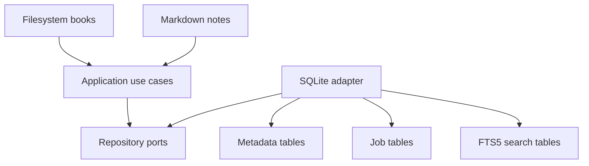

# Purpose

Record the decision to use SQLite as the local database for Book Library metadata, operational state, jobs, and search indexes.

# Background

Book Library is a desktop-first, offline-first application for a single user. It needs reliable local persistence without requiring a server. The database must support structured metadata, migrations, transactions, background job state, and full-text search. Books themselves remain in the filesystem and are never copied into the database.

Decision: use SQLite as the embedded application database.

# Requirements

- Must work offline.
- Must require no external database server.
- Must support transactional metadata updates.
- Must support schema migrations.
- Must support SQLite FTS5 for local search.
- Must be easy to back up and inspect.
- Must never store full book binaries as canonical content.
- Must be rebuildable for catalog projections by rescanning the library root.

# Responsibilities

SQLite is responsible for:

- Library configuration metadata.
- Discovered book records.
- Derived metadata and fingerprints.
- Reading state, bookmarks, and history.
- Notes projections and link indexes.
- Thumbnail, scan, OCR, and indexing job state.
- Search projections and FTS5 tables.

SQLite is not responsible for:

- Owning source book files.
- Replacing Markdown note files.
- Synchronizing through Google APIs.
- Storing absolute source paths as durable identifiers.

# Architecture

SQLite must be accessed through repository interfaces and migration tooling. The application layer should coordinate transactions. FTS5 tables should be treated as rebuildable projections. Domain entities should not contain SQL-specific assumptions.

# Mermaid Diagram

# Data Model

SQLite stores:

- `libraries`, `books`, `book_files`, `book_metadata`.
- `reading_state`, `reading_history`, `bookmarks`.
- `notes`, `note_links`, `book_note_links` as projections.
- `scan_jobs`, `thumbnail_jobs`, `search_index_jobs`, `ocr_jobs`.
- `search_documents` and FTS5 virtual tables.

# Future Extension

- Optional database export/import tools.
- Integrity check command in the app.
- Rebuild indexes command.
- Metadata sidecar export for users who want extra portability.

# Open Questions

- Should the SQLite file live in operating-system app data or inside the library root?
- Should WAL mode be enabled by default?
- Should migrations be versioned as SQL files or embedded in Rust code?
