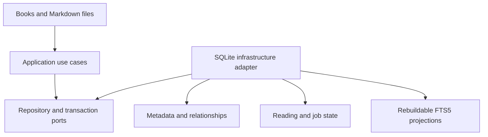

# ADR-001: Use SQLite for local operational data

- **Status:** Accepted
- **Date:** 2026-07-25

## Context

Book Library is a single-user, desktop-first, offline-first application. It needs structured local persistence for catalog metadata, reading state, relationships, background jobs, migrations, and full-text search without requiring a server.

Source books remain in the filesystem and user-authored note text remains in Markdown. The database is operational state and a projection layer, not the owner of those files.

## Decision

Use SQLite as the embedded application database.

SQLite is responsible for:

- application and library configuration metadata;
- discovered book records and derived fingerprints;
- reading state, history, and bookmarks;
- note metadata, links, and search projections;
- scan, thumbnail, indexing, and later OCR job state;
- SQLite FTS5 tables and supporting search documents.

SQLite is not responsible for:

- storing PDFs or page images as canonical content;
- being the only copy of Markdown note bodies;
- synchronizing files through Google APIs;
- using absolute source paths as durable book/note identifiers.

The database is stored in OS application data as defined by [ADR-005](ADR-005-local-application-data.md).

## Considered options

### External database server

Rejected because it adds installation, authentication, networking, and operational complexity to a single-user offline desktop product.

### JSON or custom files only

Rejected because transactions, migrations, relations, queries, job recovery, and full-text search would require substantial custom infrastructure.

### SQLite

Accepted because it is embedded, transactional, widely supported, inspectable, and provides FTS5.

## Architecture consequences

- Application use cases own transaction boundaries.
- Infrastructure repositories contain SQL and implement application/domain ports.
- Domain entities contain no SQL-specific assumptions.
- FTS tables, thumbnails, OCR text, and similar projections are rebuildable.
- Schema is introduced incrementally by milestone rather than creating every future table in the first migration.

## Initial persistence groups

The architecture anticipates these groups, added only when required:

- configuration: settings and configured libraries;
- catalog: books, book files, metadata, and scan issues;
- operations: scan, thumbnail, indexing, and OCR jobs;
- reading: current state, history, and bookmarks;
- notes: file projections and relationships;
- search: search documents and FTS5 tables.

## Implementation constraints

- Enable foreign keys for every connection.
- Use a versioned forward-only migration mechanism.
- Validate migration failure and recovery behavior with temporary databases.
- Select journal mode only after Windows behavior is tested during Sprint 01.
- Never infer that a SQLite backup also backs up source books or Markdown notes.
- Do not synchronize a live SQLite database through Google Drive Desktop as a substitute for designed metadata sync.
- Keep repository methods aligned with use-case concepts rather than exposing generic database CRUD to the UI.

## Follow-up decisions

Sprint 01 must record the chosen Rust SQLite library, migration organization, connection model, transaction convention, and validated journal mode. Those implementation choices must comply with this ADR and ADR-005.

## Revisit when

Revisit SQLite only if measured requirements cannot be met by its concurrency, query, migration, or FTS capabilities. A replacement must preserve offline operation and the canonical ownership of books and Markdown notes.