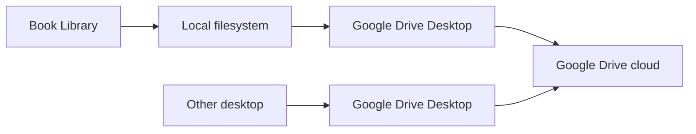

# Purpose

Record the decision to rely on Google Drive Desktop for synchronization instead of integrating Google Drive APIs into Book Library.

# Background

The user already stores files in a local folder that may be synchronized by Google Drive Desktop. Book Library should operate on local files and remain useful without network access. Direct cloud integration would add authentication, API quotas, conflict semantics, network failures, and privacy complexity that are unnecessary for the core product.

Decision: Book Library treats Google Drive Desktop as an external synchronization layer and interacts only with the local filesystem.

# Requirements

- Work with normal Windows local paths.
- Avoid Google account login inside the app.
- Avoid Google Drive API dependencies.
- Tolerate files being hydrated, updated, or removed by Google Drive Desktop.
- Keep source-of-truth semantics local: files appear as local filesystem entries.
- Avoid promising real-time multi-device conflict resolution in the first architecture.

# Responsibilities

Book Library is responsible for:

- Reading local files.
- Watching local filesystem changes.
- Recording local metadata and derived indexes.
- Handling missing, placeholder, or temporarily unavailable files gracefully.

Google Drive Desktop is responsible for:

- Syncing files between machines.
- Cloud storage.
- Account authentication.
- Remote conflict handling.

# Architecture

The app sees Google Drive Desktop folders as ordinary local folders. Filesystem watcher and scanner modules should be robust to sync churn. The app should not call Google Drive APIs, store OAuth credentials, or depend on network availability.

# Mermaid Diagram

# Data Model

No Google Drive identifiers are required in the core data model. Persisted data should use:

- Library settings for the selected local root.
- Relative paths for books, notes, thumbnails, and derived artifacts.
- File fingerprints for change detection.
- Watcher and scan job records for reconciliation.

# Future Extension

- Document recommended Google Drive Desktop configuration.
- Add diagnostics for cloud placeholder files if Windows exposes useful signals.
- Add optional metadata conflict review if database or sidecar files are synced.
- Consider other sync tools such as OneDrive, Dropbox, Syncthing, or Git-annex through the same local-filesystem model.

# Open Questions

- Should the app warn if the selected root appears to be cloud-synced?
- Should the app store its SQLite database inside a synced folder or local app data?
- How should the watcher debounce Google Drive Desktop rename/update bursts?
