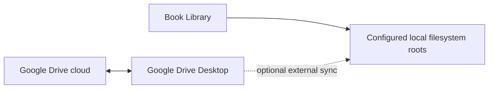

# ADR-002: Treat Google Drive Desktop as an external sync layer

- **Status:** Accepted
- **Date:** 2026-07-25

## Context

The user's library may live in a folder synchronized by Google Drive Desktop. Direct Google Drive API integration would introduce account authentication, OAuth secret handling, quotas, network failures, cloud-specific identifiers, conflict semantics, and additional privacy surface before the core local reader exists.

Book Library must continue to work when the Internet is unavailable and should remain compatible with other folder-sync products.

## Decision

Book Library interacts only with the local filesystem. Google Drive Desktop, when present, is an external synchronization layer.

The application:

- does not require Google account login;
- does not call Google Drive APIs;
- does not store OAuth credentials;
- does not persist Google Drive file identifiers in the core model;
- treats synchronized folders as ordinary configured local roots;
- handles missing, placeholder, hydrating, changing, or temporarily unavailable files as recoverable filesystem states.

Google Drive Desktop remains responsible for cloud storage, authentication, cross-device file transfer, and remote conflict behavior.

## Considered options

### Integrate Google Drive APIs

Rejected for the committed roadmap because it conflicts with offline-first delivery and adds substantial cloud-specific scope without improving the core local reading workflow.

### Require users to copy the full library into app-owned storage

Rejected because it duplicates data, breaks user ownership, and conflicts with filesystem-first behavior.

### Operate on local folders and let sync tools remain external

Accepted because it keeps the app offline, portable, and compatible with Google Drive Desktop, OneDrive, Dropbox, Syncthing, and normal local folders.

## Architecture consequences

- scanner and watcher behavior must tolerate sync churn;
- unavailable files are reported per item rather than crashing or invalidating the whole catalog;
- local relative paths and fingerprints drive catalog reconciliation;
- cloud-specific behavior remains outside domain entities and application use cases;
- database and generated artifacts remain outside synchronized source folders under ADR-005.

## Implementation constraints

- Never place the live SQLite database, WAL files, logs, thumbnails, or cache inside the selected library root.
- Do not assume a directory entry means file bytes are immediately available.
- Model unavailable/placeholder behavior as a recoverable state with user-readable guidance.
- Debounce watcher event bursts and retain manual rescan as a reliable fallback.
- Avoid destructive reactions to transient delete/rename events; reconciliation decides the durable catalog outcome.
- Keep network access absent from core modules.

## Follow-up work

Sprint 01 includes a disposable Google Drive Desktop filesystem spike to document placeholder signals, open failures, and watcher event patterns. M5 owns production watcher debouncing and recovery.

Warnings that a selected folder is cloud-synchronized are optional UX guidance, not a prerequisite for supporting that folder.

## Revisit when

Revisit direct cloud integration only if a future product requirement explicitly needs remote browsing without local availability, account-based sync, or designed metadata conflict resolution. Such work must be optional and must not replace the local-filesystem path.