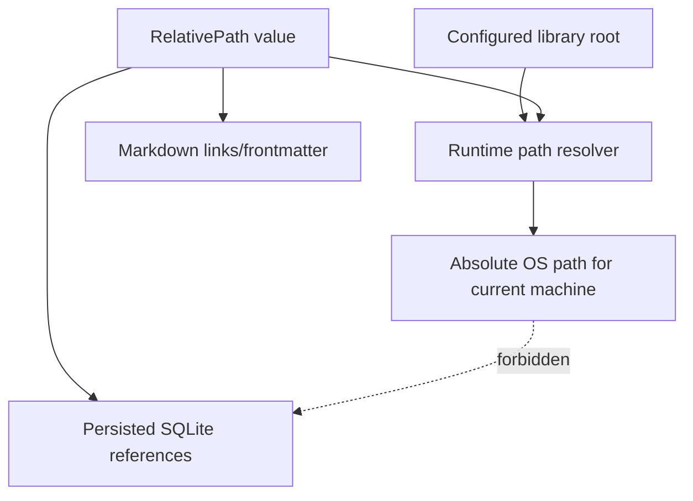

# Purpose

Record the decision to persist relative paths only for library content and derived artifacts.

# Background

The same library may live at different absolute paths on different machines, such as different Windows drive letters or Google Drive Desktop locations. Absolute paths make backups, restores, and multi-machine use fragile. Relative paths preserve portability and reinforce the library root as the boundary.

Decision: persisted references to books, image pages, notes, thumbnails, and derived artifacts must be relative to a configured root or cache namespace.

# Requirements

- No persisted absolute paths for source books.
- Normalize paths consistently.
- Prevent path traversal outside the root.
- Use relative paths as user-visible and portable identifiers.
- Reconstruct absolute paths only at runtime.
- Make path policy explicit in repositories and migrations.

# Responsibilities

The path model is responsible for:

- Portability across machines.
- Stable references inside Markdown and SQLite.
- Safe runtime resolution.
- Clear separation between configured root and stored item references.

Implementation must reject:

- Drive-letter paths in persisted source references.
- UNC absolute paths in book records.
- Leading root separators.
- `..` path escapes.

# Architecture

Use a `RelativePath` value object in the domain layer. Infrastructure adapters convert between OS paths and relative paths at boundaries. Repositories should accept relative paths, not raw strings, when writing durable records.

# Mermaid Diagram

# Data Model

Persisted examples:

- `AI/ChatGPT.pdf`
- `Manga/Conan`
- `Manga/Conan/001.png`
- `Notes/AI/ChatGPT.md`

Forbidden persisted examples:

- `D:\Books\AI\ChatGPT.pdf`
- `C:\Users\Dat\Google Drive\LibraryRoot\Manga\Conan`
- `../outside-root/file.pdf`

# Future Extension

- Path migration tools for renames.
- Folder ignore rules using relative patterns.
- Library relocation wizard.
- Static migration tests that reject `absolute_path` columns for content references.

# Open Questions

- Should app settings store the current absolute root path separately from the library database?
- Should relative paths preserve original case or use case-insensitive matching on Windows?
- Should path separators always be stored as `/` even on Windows?
