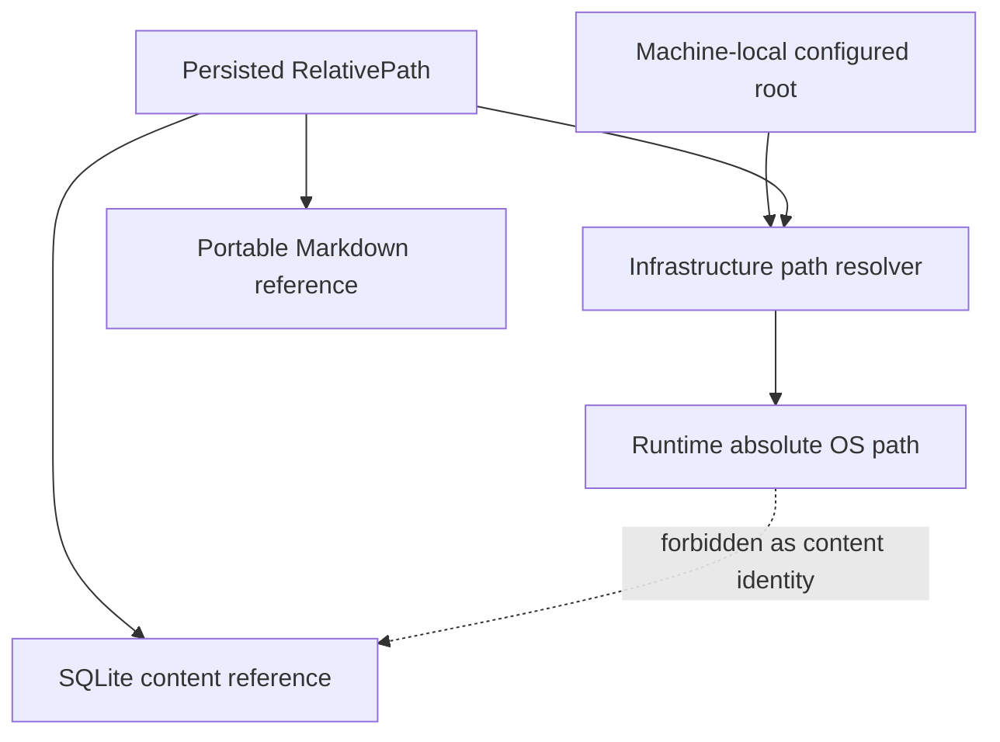

# ADR-003: Persist content references as relative paths

- **Status:** Accepted
- **Date:** 2026-07-25

## Context

The same library may appear under different drive letters and absolute locations on different Windows machines, especially when Google Drive Desktop or another sync tool is involved. Persisting absolute source paths would make restores, relocation, and multi-machine use fragile.

The application still needs an absolute root to access files on the current machine. That root is machine-local configuration, not a durable identity for content.

## Decision

Persist references to filesystem-backed content as normalized relative paths within an explicit namespace.

- book and image-page paths are relative to the configured library root;
- note paths are relative to the configured notes root;
- application-cache references are relative to the application cache namespace;
- current absolute roots are stored only as machine-local settings under ADR-005;
- absolute paths are reconstructed only at infrastructure boundaries.

The persisted textual representation uses `/` as the separator on every platform and preserves the original safe path-segment case.

## Validity rules

A `RelativePath` value must:

- contain no drive-letter prefix;
- contain no UNC or device prefix;
- contain no leading root separator;
- normalize `\` to `/`;
- reject traversal that escapes the configured root;
- define empty, `.`, duplicate-separator, and trailing-separator behavior explicitly;
- preserve valid Unicode path segments;
- be safely resolvable beneath its owning configured root.

Examples:

```text
AI/ChatGPT.pdf
Manga/Conan
Manga/Conan/001.png
AI/ChatGPT.md
```

Forbidden persisted values include:

```text
D:\Books\AI\ChatGPT.pdf
\\server\share\book.pdf
/Books/book.pdf
../outside-root/file.pdf
```

## Considered options

### Persist absolute paths

Rejected because absolute paths are machine-specific and encourage domain/database coupling to one operating-system location.

### Store arbitrary raw path strings

Rejected because separators, traversal, roots, and equality would be handled inconsistently throughout the codebase.

### Use a validated domain value object

Accepted. `RelativePath` centralizes normalization and safety rules before values reach repositories.

## Architecture consequences



- domain/application APIs prefer `RelativePath` instead of raw strings;
- infrastructure converts between OS paths and domain paths;
- repositories reject invalid paths before persistence;
- relocation changes a root setting, not every book or note record;
- migrations must not introduce absolute content-reference columns.

## Case and identity

The persisted representation preserves case. Windows file lookup may be case-insensitive, but Unicode-aware identity and rename handling are separate catalog concerns.

M1 must define and test the repository's uniqueness key for Windows paths and the policy for case-only renames. Do not rely blindly on SQLite's built-in ASCII-only `NOCASE` behavior for general Unicode filenames.

## Implementation constraints

- Test drive-letter, UNC, rooted, traversal, Unicode, nested, and separator cases.
- Resolve with a boundary check that proves the resulting path remains beneath the configured root.
- Never concatenate unvalidated user text onto an absolute root.
- Keep absolute roots out of domain entities except in explicitly non-persistable infrastructure/runtime types.
- Preserve display paths separately only when needed; do not create competing path-normalization implementations.

## Revisit when

Revisit this decision only if a supported content source has no meaningful hierarchical path namespace. Any replacement must retain portability, safe resolution, and machine-independent content identity.