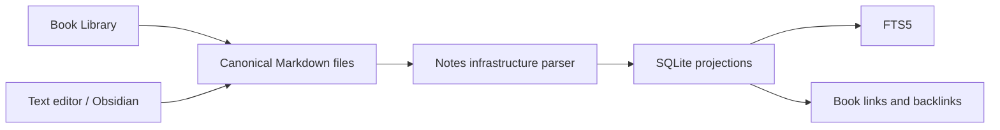

# ADR-004: Keep user-authored notes in Markdown files

- **Status:** Accepted
- **Date:** 2026-07-25

## Context

Book Library is a reading and personal-knowledge application. Notes should outlive the app, remain editable in normal tools, and work with Obsidian-style workflows. A database-only rich-text model would create lock-in and make recovery dependent on application-specific storage.

The application still needs fast search, links, associations, and UI projections, but those derived structures do not need to own note text.

## Decision

Store user-authored note text as `.md` files. Markdown is canonical for the note body. SQLite stores rebuildable projections, relationships, and search indexes.

Markdown files own:

- durable note body text;
- user headings, tags, and human-readable links;
- user-controlled organization and filenames;
- optional YAML frontmatter.

SQLite may own:

- discovered note records and fingerprints;
- parsed titles, headings, tags, and links;
- book/note and reading-location associations;
- backlink caches and search projections;
- indexing/reconciliation job state.

AI-generated text remains a draft until the user explicitly accepts writing it into a canonical note.

## Considered options

### Store notes only in SQLite

Rejected because it prevents normal file ownership, external editing, and straightforward recovery.

### Use a proprietary document format

Rejected because it creates avoidable lock-in and poor interoperability.

### Use Markdown as canonical content with SQLite projections

Accepted because it balances portability with efficient application queries.

## Architecture consequences

- the notes module reads and writes files through explicit ports;
- parsing updates SQLite without rewriting user formatting;
- projection loss is recoverable by rescanning Markdown files;
- external edits are legitimate and must be reconciled;
- app behavior must not depend on hidden binary state inside note files.

## Markdown compatibility baseline

- CommonMark-compatible Markdown is the baseline;
- YAML frontmatter is optional;
- relative Markdown links and Obsidian-style wiki links may be parsed;
- unsupported syntax should be preserved rather than destructively normalized;
- writes should be conservative and targeted.

The exact portable representation of book and reading-location links is decided before M3 implementation.

## Implementation constraints

- Persist note references relative to the configured notes root under ADR-003.
- Never make SQLite the only copy of user-authored note text.
- Do not rewrite a note merely to refresh a projection or index.
- Preserve unknown frontmatter keys and formatting whenever an explicit edit is required.
- Use atomic file-write behavior for app-initiated edits.
- Detect external changes through fingerprints/watcher reconciliation.
- Keep generated suggestions visibly distinct until accepted.

## Follow-up decisions

Before M3 starts, decide:

- default notes-root policy and whether it may be outside the library root;
- internal editor scope versus external-editor-first behavior;
- whether app-created notes include frontmatter by default;
- the portable representation of book/location associations;
- the preservation strategy for frontmatter comments and ordering.

## Revisit when

Revisit Markdown ownership only if a future requirement cannot be represented portably. Any additional format must provide lossless export and cannot make existing Markdown notes second-class.