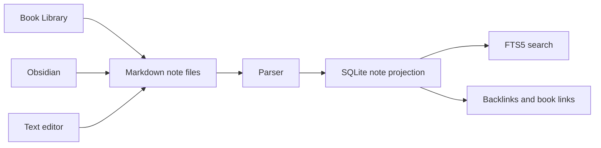

# Purpose

Record the decision to store notes as Markdown files instead of database-only rich text or proprietary documents.

# Background

Book Library is a personal knowledge platform, not only a reader. Notes should outlive the app, be editable by external tools, and work naturally with Obsidian. A database-only note system would create lock-in and conflict with local-first principles.

Decision: user-authored notes are stored as Markdown files. SQLite stores note metadata, links, search projections, and associations only.

# Requirements

- Notes must be readable as plain text.
- Notes must be stored as `.md` files.
- Notes must support relative links.
- Notes must be compatible with Obsidian workflows.
- SQLite must not be the only copy of user-authored note text.
- App-generated AI content must be inserted only when accepted by the user.
- Markdown parsing should preserve user formatting when possible.

# Responsibilities

Markdown files are responsible for:

- Durable note text.
- Human-readable knowledge content.
- Obsidian-compatible links and tags.
- User-controlled organization.

SQLite is responsible for:

- Note discovery and projections.
- Search indexing.
- Book-note associations.
- Link and backlink caches.

# Architecture

The notes module treats Markdown as source content and SQLite as a projection. File writes should be conservative. Parsing should update projection tables, not rewrite user notes unnecessarily. Notes may include YAML frontmatter for portable metadata, but app behavior should not depend exclusively on frontmatter.

# Mermaid Diagram

# Data Model

Markdown remains canonical for:

- Note body.
- User headings.
- User tags.
- Human-readable links.

SQLite projections include:

- `notes.relative_path`.
- `notes.title`.
- `note_links`.
- `note_tags`.
- `book_note_links`.
- `search_documents` for note text.

# Future Extension

- Note templates.
- Backlink graph.
- App command to open current note in Obsidian.
- Markdown-based export of bookmarks, highlights, and AI-generated drafts.

# Open Questions

- Should app-created notes always include YAML frontmatter?
- Should book-note links be duplicated in both frontmatter and SQLite?
- Should app edits preserve frontmatter comments and ordering?
