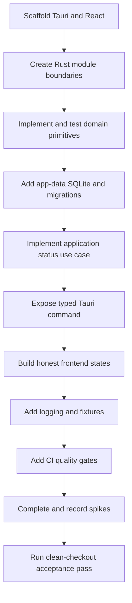

# Sprint 01 — Engineering Foundation

## Status

- **State:** Ready
- **Milestone:** M0 — Engineering foundation
- **Implementation:** not started
- **Feature IDs:** ENG-001 through ENG-008

## Sprint goal

Create a runnable Windows 11 desktop application foundation that proves the documented architecture and is ready for library initialization work.

This sprint does not implement a production scanner or reader. It establishes the application shell, domain primitives, SQLite migrations, typed desktop boundary, testing, CI, and the technical evidence needed for later reader/filesystem work.

## Accepted decisions used by this sprint

- SQLite is the local operational database (`ADR-001`).
- Google Drive Desktop remains external to the app (`ADR-002`).
- content references use normalized relative paths (`ADR-003`).
- note text remains Markdown (`ADR-004`).
- database, caches, thumbnails, and logs live in OS application data (`ADR-005`).
- core domain/application behavior lives in a Rust modular monolith (`ADR-006`).

Do not reopen these decisions inside implementation tasks without proposing a superseding ADR.

## Work packages

### WP1 — Application scaffold (`ENG-001`, `ENG-002`)

- Scaffold Tauri 2 with React and TypeScript.
- Configure the minimum Tailwind CSS and shadcn/ui setup needed for the shell.
- Create Rust modules:

```text
src-tauri/src/
  domain/
  application/
  infrastructure/
  desktop/
```

- Add an explicit composition root.
- Keep module exports narrow; no generic shared `utils` package.
- Document the actual prerequisite and development commands in the README after the scaffold exists.

**Acceptance checks**

- development mode opens a desktop window on Windows 11;
- production builds compile in CI or a documented Windows environment;
- React contains no SQLite or direct source-filesystem dependency;
- `domain` contains no Tauri/infrastructure dependency.

### WP2 — Domain foundation (`ENG-005`)

Implement infrastructure-independent primitives:

- `LibraryId`;
- `BookId`;
- `RelativePath`;
- `BookKind` with `pdf_file` and `image_folder`;
- `BookStatus` with at least `available`, `missing`, `unsupported`, and `error`;
- `ContentFingerprint` as a derived change-detection value;
- common typed domain errors.

`RelativePath` tests must cover:

- normalizing Windows `\` separators to `/` for persisted values;
- rejecting drive-letter, UNC, and rooted paths;
- rejecting paths that escape through `..`;
- allowing safe nested paths;
- preserving Unicode names;
- defining empty path and `.` segment behavior explicitly;
- stable equality behavior appropriate for the initial Windows target.

### WP3 — SQLite and application-data foundation (`ENG-004`, `ENG-008`)

- Select a Rust SQLite library and migration mechanism.
- Resolve the database path through Tauri OS application-data APIs.
- Implement connection initialization and a forward-only migration runner.
- Enable foreign keys for every connection.
- Validate journal mode and concurrent access behavior on Windows before enabling WAL by default.
- Add the smallest initial schema needed for:
  - schema version/history;
  - application settings;
  - configured libraries;
  - optional minimal job envelope only when used by the health flow.
- Add temporary-database and temporary-app-data integration fixtures.

**Acceptance checks**

- first launch creates and migrates the database;
- later launches do not rerun applied migrations incorrectly;
- migration failure returns a typed recoverable startup error with diagnostic context;
- no database/cache file is created inside a selected library fixture;
- foreign-key behavior is tested.

### WP4 — Application and Tauri boundary (`ENG-003`)

Implement one complete vertical slice:

```text
React -> typed Tauri command -> GetApplicationStatus use case -> health/settings ports -> response
```

Define:

- application status request/response;
- database health port;
- current library configuration read model;
- desktop-safe error envelope with stable code and message;
- typed event envelope and naming convention for future job progress;
- cancellation contract shape for future long-running use cases without implementing the scanner.

Tauri commands must only validate/translate/delegate. Domain entities do not need to be serialized directly when a dedicated DTO is safer.

### WP5 — Frontend shell (`ENG-001`, `ENG-003`)

Create the initial application frame with navigation placeholders for:

- Library;
- Recent;
- Notes;
- Search;
- Settings.

Implement real states for:

- startup loading;
- healthy application with no configured library;
- database/configuration startup failure;
- global React error boundary;
- development-only health details that do not expose sensitive paths.

Do not build fake catalog, reader, notes, or search behavior.

### WP6 — Logging and diagnostics (`ENG-006`)

- Add structured local logging with development/release levels.
- Store logs in OS application data.
- Include operation identifiers and error codes where useful.
- Do not log note bodies, PDF text, page images, provider secrets, or unnecessary absolute paths.
- Document where logs are stored and how developers can inspect them.
- A user-facing export/reveal command is deferred unless trivial after the foundation exists.

### WP7 — CI and quality gates (`ENG-007`)

CI must run the commands actually present in the repository:

- Rust formatting check;
- Rust lint with warnings treated according to the agreed policy;
- Rust unit/integration tests;
- TypeScript type check;
- frontend tests when configured;
- frontend production build;
- Tauri/Rust build validation feasible for the runner environment;
- Markdown linting or internal-link validation.

The workflow must fail when a required check fails. Do not list checks in documentation that CI does not execute.

## Technical spikes

Complete and document these before closing the sprint.

### Spike A — PDFium on Windows

Evaluate candidate Rust bindings and produce an ADR or technical report covering:

- project maintenance and API suitability;
- PDFium native binary source and versioning;
- Windows development and installer packaging;
- licensing/distribution obligations;
- proposed page-render transfer to the WebView;
- a minimal fixture render when feasible.

A production reader is out of scope.

### Spike B — Google Drive Desktop filesystem behavior

Using a disposable synchronized folder, document:

- locally available files;
- online-only/placeholders and availability signals;
- behavior when opening an unavailable file;
- create/modify/rename/delete watcher events during synchronization;
- burst/debounce observations;
- proposed scanner and user-error behavior.

Do not place project database or cache files in the synchronized test folder.

### Spike C — SQLite implementation choices

Record the chosen:

- Rust SQLite library;
- migration mechanism and migration-file organization;
- connection ownership/pooling model for a desktop app;
- transaction convention;
- journal mode after Windows validation;
- backup/integrity-check path for later milestones.

Database location is already decided by ADR-005.

## Deliverables

- runnable Tauri desktop shell;
- React application frame with honest empty/error states;
- Rust modular-monolith structure;
- tested domain primitives, especially `RelativePath`;
- SQLite application-data initialization and migration system;
- typed status flow from React through a real use case;
- structured safe logging;
- temporary filesystem/database fixtures;
- CI quality gates;
- three documented spike outcomes.

## End-to-end acceptance criteria

```gherkin
Given a clean Windows 11 development environment with documented prerequisites
When the repository is installed, built, and started using documented commands
Then the Book Library desktop window opens
And the initial SQLite database is created in OS application data
And all migrations are applied exactly once
And React displays the result of a typed application-status use case
And the UI shows that no library root is configured
```

```gherkin
Given an absolute, UNC, rooted, or escaping filesystem path
When the domain attempts to create a persisted RelativePath
Then validation rejects it with a typed error
And no invalid value reaches SQLite
```

```gherkin
Given a temporary valid nested path containing Unicode characters and Windows separators
When it is converted to a persisted RelativePath
Then separators are normalized to `/`
And safe Unicode path segments are preserved
```

```gherkin
Given CI runs for the branch
When formatting, linting, tests, type checking, link validation, or required builds fail
Then the workflow fails
And the feature catalog remains no further than In Progress
```

## Out of scope

- production library scanning/discovery;
- PDF or image rendering UI;
- thumbnail generation;
- reading progress and bookmarks;
- Markdown note editing;
- FTS5 user search;
- filesystem watcher implementation beyond the spike;
- OCR, dictionary, AI, Anki, or plugin implementation.

## Suggested implementation sequence



Mechanical scaffold changes, domain behavior, SQLite foundation, and CI may be separate commits or pull requests as long as each leaves the branch buildable and the final acceptance flow is integrated.

## Definition of done

- every end-to-end acceptance criterion passes;
- actual build/test/development commands are documented;
- critical domain and migration behavior is tested;
- the app creates no operational artifacts in source folders;
- no implemented layer violates the accepted dependency direction;
- spike outcomes are recorded and remaining risks are explicit;
- feature catalog statuses reflect real merged implementation;
- documentation matches the final dependencies and repository structure.