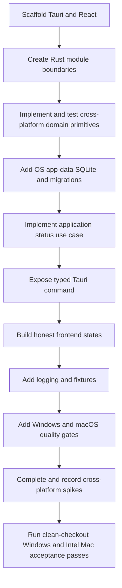

# Sprint 01 — Engineering Foundation

## Status

- **State:** Ready
- **Milestone:** M0 — Engineering foundation
- **Implementation:** not started
- **Feature IDs:** ENG-001 through ENG-008

## Sprint goal

Create one runnable desktop application foundation for Windows 11 x64 and macOS Intel x64 that proves the documented architecture and is ready for library initialization work.

This sprint does not implement a production scanner or reader. It establishes the cross-platform application shell, domain primitives, SQLite migrations, typed desktop boundary, testing, CI, and technical evidence needed for later reader/filesystem work.

## Accepted decisions used by this sprint

- SQLite is the local operational database (`ADR-001`).
- Google Drive Desktop remains external to the app (`ADR-002`).
- content references use normalized relative paths (`ADR-003`).
- note text remains Markdown (`ADR-004`).
- database, caches, thumbnails, and logs live in OS application data (`ADR-005`).
- core domain/application behavior lives in a Rust modular monolith (`ADR-006`).
- Windows 11 x64 and macOS Intel x64 are required platforms using one codebase (`ADR-007`).

Do not reopen these decisions inside implementation tasks without proposing a superseding ADR.

## Work packages

### WP1 — Cross-platform application scaffold (`ENG-001`, `ENG-002`)

- Scaffold Tauri 2 with React and TypeScript.
- Configure the minimum Tailwind CSS and shadcn/ui setup needed for the shell.
- Create Rust modules:

```text
src-tauri/src/
  domain/
  application/
  infrastructure/
  desktop/
```

- Add an explicit composition root.
- Keep module exports narrow; no generic shared `utils` package.
- Keep operating-system conditionals inside `infrastructure` or `desktop` unless a lower-level compatibility helper is demonstrably platform-neutral.
- Document actual prerequisites and development commands for Windows 11 x64 and macOS Intel x64 after the scaffold exists.

**Acceptance checks**

- development mode opens a desktop window on Windows 11 x64;
- development mode opens the same application on a real macOS Intel x64 machine;
- production or release-profile builds compile in compatible Windows and macOS environments;
- React contains no SQLite or direct source-filesystem dependency;
- `domain` contains no Tauri, infrastructure, or operating-system dependency;
- the application is not split into separate Windows and macOS product implementations.

### WP2 — Domain foundation (`ENG-005`)

Implement infrastructure-independent primitives:

- `LibraryId`;
- `BookId`;
- `RelativePath`;
- `BookKind` with `pdf_file` and `image_folder`;
- `BookStatus` with at least `available`, `missing`, `unsupported`, and `error`;
- `ContentFingerprint` as a derived change-detection value;
- common typed domain errors.

`RelativePath` tests must cover:

- normalizing Windows `\` separators to `/` for persisted values;
- accepting safe `/`-separated relative paths produced on either platform;
- rejecting drive-letter, UNC, Windows-rooted, and POSIX-rooted paths;
- rejecting paths that escape through `..`;
- allowing safe nested paths;
- preserving Unicode names and original normalized spelling;
- defining empty path and `.` segment behavior explicitly;
- exact equality after separator and segment normalization without unconditional lowercasing;
- keeping case-collision and filesystem-specific comparison outside the domain value object.

Symlink containment is an infrastructure concern, but test contracts must require adapters to prevent resolved paths from escaping the configured root.

### WP3 — SQLite and application-data foundation (`ENG-004`, `ENG-008`)

- Select a Rust SQLite library and migration mechanism that supports both targets.
- Resolve the database path through Tauri OS application-data APIs on Windows and macOS.
- Implement connection initialization and a forward-only migration runner.
- Enable foreign keys for every connection.
- Validate journal mode and concurrent access behavior on Windows 11 x64 and macOS Intel x64 before enabling WAL by default.
- Add the smallest initial schema needed for:
  - schema version/history;
  - application settings;
  - configured libraries;
  - optional minimal job envelope only when used by the health flow.
- Add temporary-database and temporary-app-data integration fixtures that do not assume Windows path syntax.

**Acceptance checks**

- first launch creates and migrates the database in the correct OS application-data location on both platforms;
- later launches do not rerun applied migrations incorrectly;
- migration failure returns a typed recoverable startup error with diagnostic context;
- no database/cache file is created inside a selected library fixture;
- foreign-key behavior is tested;
- database initialization does not require platform-specific logic in domain or application modules.

### WP4 — Application and Tauri boundary (`ENG-003`)

Implement one complete vertical slice:

```text
React -> typed Tauri command -> GetApplicationStatus use case -> health/settings ports -> response
```

Define:

- application status request/response;
- database health port;
- current library configuration read model;
- supported-platform/build information suitable for development diagnostics;
- desktop-safe error envelope with stable code and message;
- typed event envelope and naming convention for future job progress;
- cancellation contract shape for future long-running use cases without implementing the scanner.

Tauri commands must only validate/translate/delegate. Domain entities do not need to be serialized directly when a dedicated DTO is safer. Platform-specific data exposed to React must remain diagnostic or capability information, not a branch in core product rules.

### WP5 — Frontend shell (`ENG-001`, `ENG-003`)

Create the initial application frame with navigation placeholders for:

- Library;
- Recent;
- Notes;
- Search;
- Settings.

Implement real states for:

- startup loading;
- healthy application with no configured library;
- database/configuration startup failure;
- unsupported or failed native capability when applicable;
- global React error boundary;
- development-only health details that do not expose sensitive paths.

The shell must remain functionally equivalent on Windows and macOS. Native window chrome and standard operating-system behavior may differ.

Do not build fake catalog, reader, notes, or search behavior.

### WP6 — Logging and diagnostics (`ENG-006`)

- Add structured local logging with development/release levels.
- Store logs in each operating system's application-data location.
- Include operation identifiers, platform/target metadata, and error codes where useful.
- Do not log note bodies, PDF text, page images, provider secrets, or unnecessary absolute paths.
- Document where logs are stored and how developers can inspect them on Windows and macOS.
- A user-facing export/reveal command is deferred unless trivial after the foundation exists.

### WP7 — CI and quality gates (`ENG-007`)

CI must run the commands actually present in the repository and cover compatible Windows and macOS environments:

- Rust formatting check;
- Rust lint with warnings treated according to the agreed policy;
- Rust unit/integration tests;
- TypeScript type check;
- frontend tests when configured;
- frontend production build;
- Tauri/Rust build validation for Windows x64 and macOS Intel x64 where the runner/toolchain can execute the target;
- Markdown linting or internal-link validation.

The workflow must fail when a required check fails. Do not list checks or platform coverage in documentation that CI does not execute.

If hosted CI cannot execute a real Intel macOS binary, it must still perform the strongest compatible macOS build checks and the Sprint cannot close until a documented smoke test passes on the owner's Intel Mac.

## Technical spikes

Complete and document these before closing the sprint.

### Spike A — PDFium on Windows x64 and macOS Intel x64

Evaluate candidate Rust bindings and produce an ADR or technical report covering:

- project maintenance and API suitability;
- PDFium native binary source and versioning for both targets;
- Windows DLL loading, development, and installer packaging;
- macOS Intel dylib/framework loading, application bundle placement, and compatible toolchain requirements;
- signing/notarization implications for native binaries;
- licensing/distribution obligations;
- proposed page-render transfer to the WebView;
- the same minimal fixture render on Windows and a real Intel Mac when feasible.

A production reader and public release signing pipeline are out of scope.

### Spike B — Google Drive Desktop filesystem behavior on both platforms

Using disposable synchronized folders on Windows and macOS Intel, document:

- locally available files;
- online-only/placeholders and availability signals;
- behavior when opening an unavailable file;
- create/modify/rename/delete watcher events during synchronization;
- burst/debounce observations;
- macOS permission, hidden-file, and mount-location behavior;
- proposed shared scanner contract and platform-specific user-error behavior.

Do not place project database or cache files in synchronized test folders.

### Spike C — SQLite implementation choices across both platforms

Record the chosen:

- Rust SQLite library and supported target evidence;
- migration mechanism and migration-file organization;
- connection ownership/pooling model for a desktop app;
- transaction convention;
- journal mode after Windows and macOS validation;
- application-data path behavior on both operating systems;
- backup/integrity-check path for later milestones.

Database location is already decided by ADR-005.

## Deliverables

- runnable Tauri desktop shell on Windows 11 x64 and macOS Intel x64;
- React application frame with honest empty/error states;
- shared Rust modular-monolith structure;
- tested cross-platform domain primitives, especially `RelativePath`;
- SQLite application-data initialization and migration system on both platforms;
- typed status flow from React through a real use case;
- structured safe logging;
- temporary filesystem/database fixtures;
- Windows/macOS CI quality gates plus documented Intel Mac smoke evidence;
- three documented cross-platform spike outcomes.

## End-to-end acceptance criteria

```gherkin
Scenario Outline: launch the shared application foundation
  Given a clean <platform> development environment with documented prerequisites
  When the repository is installed, built, and started using documented commands
  Then the Book Library desktop window opens
  And the initial SQLite database is created in that operating system's application-data location
  And all migrations are applied exactly once
  And React displays the result of a typed application-status use case
  And the UI shows that no library root is configured

  Examples:
    | platform |
    | Windows 11 x64 |
    | macOS Intel x64 |
```

```gherkin
Given a drive-letter, UNC, Windows-rooted, POSIX-rooted, or escaping filesystem path
When the domain attempts to create a persisted RelativePath
Then validation rejects it with a typed error
And no invalid value reaches SQLite
```

```gherkin
Given a temporary valid nested path containing Unicode characters and Windows or POSIX separators
When it is converted to a persisted RelativePath
Then separators are normalized to `/`
And safe Unicode path segments and normalized spelling are preserved
And the value is not unconditionally lowercased
```

```gherkin
Given CI runs for the branch
When formatting, linting, tests, type checking, link validation, or required platform builds fail
Then the workflow fails
And the feature catalog remains no further than In Progress
```

```gherkin
Given the hosted CI environment cannot execute an Intel macOS binary
When Sprint 01 acceptance is evaluated
Then compatible macOS build checks must still pass
And a documented smoke test must pass on the owner's real Intel Mac
```

## Out of scope

- production library scanning/discovery;
- PDF or image rendering UI;
- thumbnail generation;
- reading progress and bookmarks;
- Markdown note editing;
- FTS5 user search;
- filesystem watcher implementation beyond the spike;
- public Windows installer release;
- public macOS signing, notarization, DMG release, and auto-update;
- Apple Silicon or universal macOS targets;
- OCR, dictionary, AI, Anki, or plugin implementation.

## Suggested implementation sequence



Mechanical scaffold changes, domain behavior, SQLite foundation, and CI may be separate commits or pull requests as long as each leaves the branch buildable and the final acceptance flow is integrated.

## Definition of done

- every end-to-end acceptance criterion passes;
- actual build/test/development commands are documented for Windows 11 x64 and macOS Intel x64;
- critical domain and migration behavior is tested;
- the app creates no operational artifacts in source folders;
- no implemented layer violates the accepted dependency direction or duplicates core behavior per platform;
- Windows and real Intel Mac smoke evidence is recorded;
- spike outcomes cover both supported platforms and remaining risks are explicit;
- feature catalog statuses reflect real merged implementation;
- documentation matches the final dependencies, platform coverage, and repository structure.