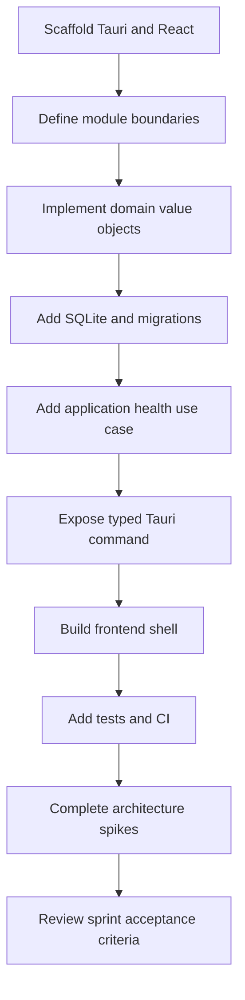

# Sprint 01 — Engineering Foundation

## Sprint goal

Create a runnable Windows 11 desktop application foundation that enforces the documented architecture and is ready for library initialization work.

This sprint should not implement the full scanner or reader. It should remove technical uncertainty and establish stable contracts, migrations, testing, and developer workflow.

## Scope

### 1. Repository and workspace setup

- Scaffold Tauri 2 with React and TypeScript.
- Configure Tailwind and Shadcn UI.
- Establish Rust module or workspace structure aligned with:
  - core domain
  - application use cases
  - SQLite infrastructure
  - filesystem infrastructure
  - desktop Tauri boundary
  - React frontend
- Add `AGENTS.md` with dependency, coding, testing, and documentation rules.

### 2. Domain foundation

Implement initial value objects and enums without infrastructure dependencies:

- `LibraryId`
- `BookId`
- `RelativePath`
- `BookKind`
- `BookStatus`
- `ContentFingerprint`
- common domain errors

Required tests:

- normalize Windows separators to `/` for persisted values.
- reject absolute paths.
- reject path traversal outside the root.
- preserve Unicode names.
- support nested folder paths.

### 3. Application contracts

Define ports and request/response models for:

- application status
- library settings
- database health
- future `InitializeLibrary` use case
- progress event envelope
- cancellation token or job cancellation contract

Only a health/status use case needs a working end-to-end implementation in this sprint.

### 4. SQLite foundation

- Choose and document SQLite Rust library and migration approach.
- Determine database location and record the decision in an ADR.
- Implement connection initialization.
- Implement migration runner.
- Add first schema version for:
  - schema metadata
  - application settings
  - libraries
  - job records or a minimal placeholder if required
- Enable foreign keys and appropriate journal mode after validating Windows behavior.
- Add temporary-database integration tests.

### 5. Tauri boundary

- Add a typed health/status command.
- Add a typed configuration command to read current app settings.
- Establish error translation from Rust errors to frontend-safe payloads.
- Establish event naming conventions for future scan progress.
- Ensure React has no raw database or filesystem access.

### 6. Frontend shell

Create the initial layout with placeholders for:

- Library
- Recent
- Notes
- Search
- Settings

Implement:

- startup loading state
- application health display for development
- global error boundary
- empty-state page explaining that a library root has not been configured

### 7. Logging and diagnostics

- Structured local logging.
- Log levels appropriate for development and release.
- Avoid logging note content, PDF text, or secrets.
- Add command to reveal or export diagnostic log location later; placeholder is acceptable now.

### 8. CI and quality gates

CI should run:

- Rust format check
- Rust lint
- Rust tests
- TypeScript type check
- frontend tests if configured
- frontend build
- Markdown lint or link validation

## Technical spikes

Complete these before closing the sprint:

### Spike A — PDFium packaging

Produce a short report or ADR covering:

- candidate Rust bindings
- Windows native DLL packaging
- development versus installer behavior
- licensing implications
- proposed rendered-page transfer strategy to the frontend

A complete reader is not required.

### Spike B — Google Drive Desktop filesystem behavior

Use a small test folder to document:

- locally available files
- online-only placeholders
- behavior when opening unavailable files
- watcher event patterns during synchronization
- recommended handling in scanner status and errors

### Spike C — Database location

Decide between:

- application data directory
- hidden directory inside library root

Evaluate portability, Google Drive sync conflicts, backups, multi-machine use, and recovery. Record the decision as an ADR.

## Deliverables

- Runnable Tauri desktop shell.
- React application shell.
- Initial Rust architecture.
- Tested `RelativePath` domain type.
- Working SQLite migration system.
- Typed health/status flow from React to Rust and back.
- CI pipeline.
- Three spike outcomes documented.

## Acceptance criteria

```gherkin
Given a clean Windows 11 development machine with prerequisites installed
When the developer builds and starts the application
Then the desktop window opens successfully
And the initial SQLite database is created and migrated
And the React frontend receives a successful typed health response
And no frontend module accesses SQLite or the filesystem directly
```

```gherkin
Given an absolute or escaping filesystem path
When it is converted to a persisted RelativePath
Then validation rejects it
And a user-safe or developer-safe error is returned as appropriate
```

```gherkin
Given CI runs for the repository
When formatting, linting, tests, type checking, or build fails
Then the workflow fails and blocks the change from being considered complete
```

## Out of scope

- Full library scan.
- PDF or image rendering.
- Thumbnail generation.
- Notes editing.
- FTS5 user search.
- OCR or AI integration.

## Suggested task order



## Definition of done

- Every acceptance criterion passes.
- New architectural decisions are recorded.
- Tests cover critical domain and migration behavior.
- No persisted absolute paths exist.
- The main branch builds from a clean checkout.
- Documentation matches the actual scaffold and dependencies.
